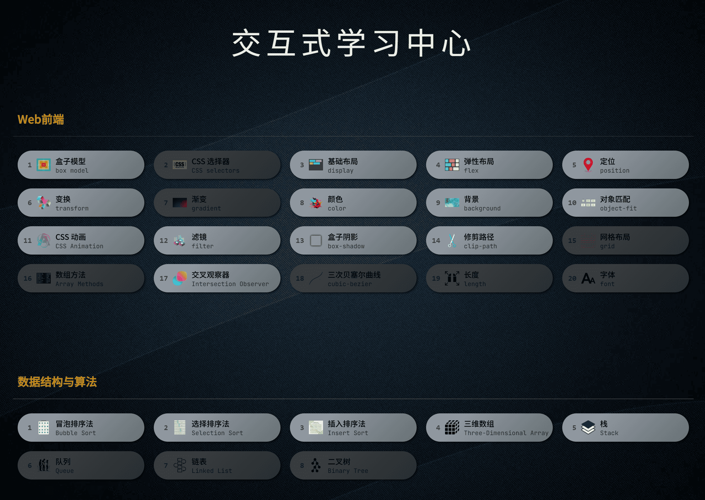
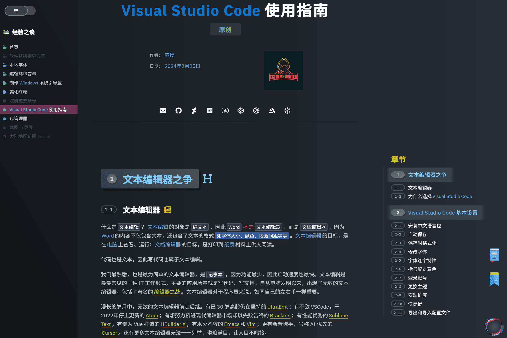
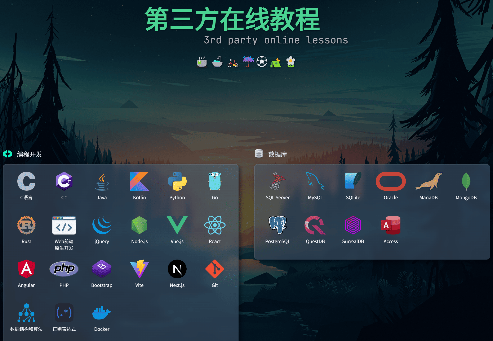
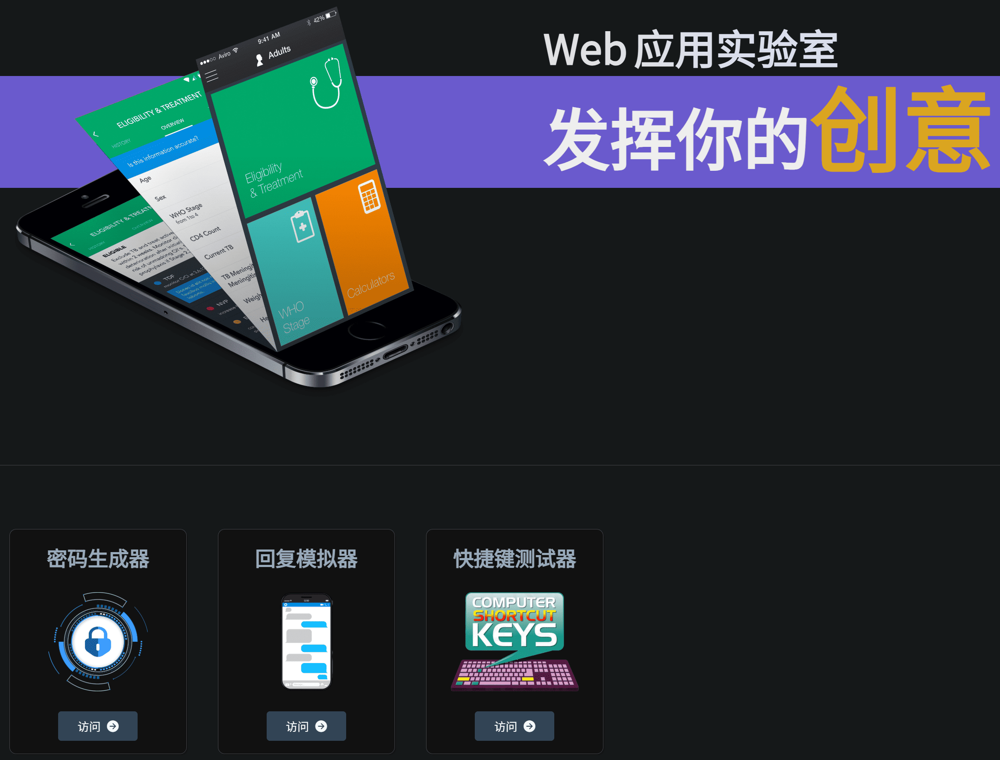
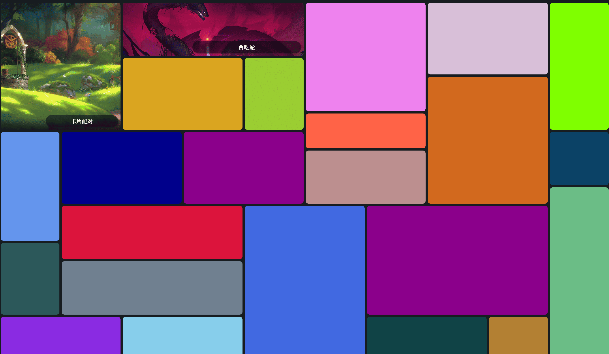

# “永恒” 网站简介

## 1. 网站直达：

[Vercel](https://suyang.vercel.app/)、[Render](https://suyang.onrender.com/)、[腾讯云](https://suyangzuo.com/)

## 2. 网站Logo、图片资产：

- 永恒Logo以及 `永恒` 艺术字，均由本人同事 `氯化银` 原创设计

- 其它图片资产：本站几乎所有图片资产均来自于互联网，版权均归其作者或版权方所有。

## 3. 主要目标：

- 打造简洁、易用、高效的在线自学网站
- 为学生提供匹配其能力与经验的教程
- 致力于提供更加具备针对性的自学形式

## 4. 开发历程：

本站开发之初，我仅学习了两天的前端基础知识（`刚搞懂什么是块元素和行内元素`），换言之，本站是在边学习、边开发的过程中诞生的。
一开始我只是想将网上搜到的各种优秀的教程网站，例如`MDN`、`W3Schools`等，做成一个聚合页面，而这个页面也成为了现在的
`第三方在线教程`。

经过本人长时间的学习和观察，类似于`MDN`、`W3Schools`、`web.dev`
这样的教程的确非常优秀，但对于学生，尤其是基础薄弱的学生来说，门槛依然太高，假如没有一定的编程基础，经常会看不懂在说什么，简单地说就是
`太高深`。

为了降低自学难度，平缓学习曲线，提升学习的信心和乐趣，我先后设计开发了`交互式学习中心`、`经验之谈`、`Web应用实验室`、`休闲游戏`
这4个模块，从多个维度为学生提供了各类学习体验。

其中，`经验之谈`非常类似于`MDN`这样的在线教程，但它也有自己的特色。如果你体验过`经验之谈`，你会发现其中包含了大量的图片（
`还有很多动图！`），这些图片的作用是为了向本站的预设阅读群体，也就是`学生`，提供更加直观的效果展示。同时，本站的文本样式更丰富（
`也显得更凌乱`），这是本站有意为之，目的是突出显示一些词汇，帮助读者聚焦重要内容。

本站事实上只有我一人进行开发、维护，且本人有全职工作（`教师兼班主任`
），因此网站的开发进度缓慢。你会看到很多模块都只有一个占位符，没有实际的内容，这是因为我根本没有时间和精力。因此，类似于
`怎么只有两个游戏？`之类的问题，就不要再反反复复地问我了。

## 5. 网站结构

- ### 主页
    - 提供各个子页面的访问入口。部分区域为纯学习测试用，并没有实际意义，比如主页的轮播图。
        
- ### 交互式学习中心
  
将代码转换为可视化选项，通过鼠标点击即可实时观察结果。

    
- ### 经验之谈
  
经典的博客类教程，图文并茂，伴有丰富的代码实例、效果演示。

    
- ### 第三方在线教程
  
搜集了全网最优秀的在线教程，分门别类进行了归纳、总结，方便读者进行访问。

    
- ### Web应用实验室
  
将各种稀奇古怪的想法付诸实践，不求完美，有创意即可！

    
- ### 休闲游戏
  
闲暇时刻不妨放松一下！

    
- ### 视频教程
  筹划中（`事实上只存在于脑海里`），我理想中的视频是学生为主持人，对知识进行讲解，非常类似于`YouTube`
  上的各种教程视频。然而理想与现实有着巨大差距，这个设想只能先暂时搁置了。