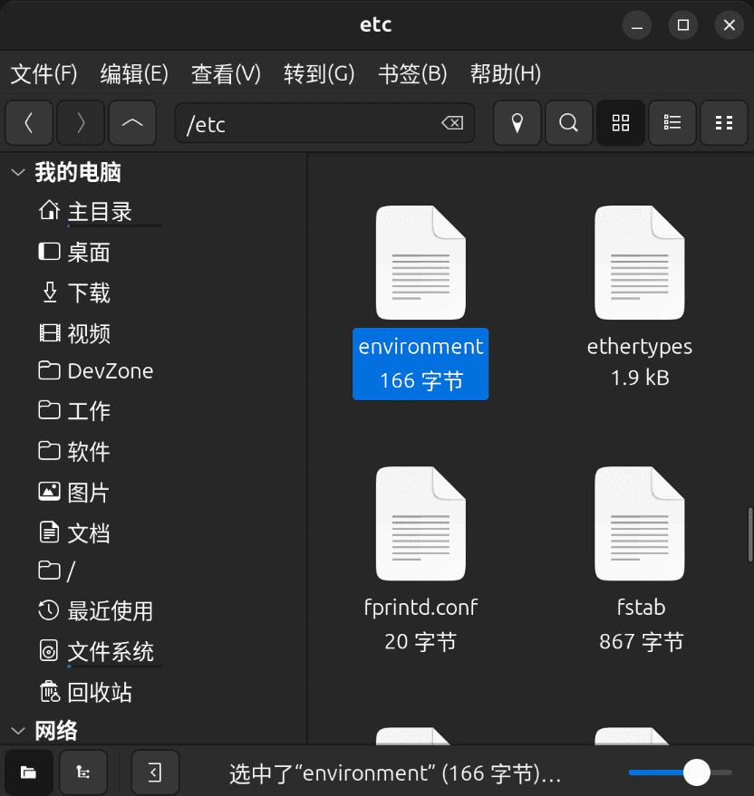

# 
使用中文输入法

## 问题描述
截至**2025年6月16日**，JetBrains系列软件的最新版本依然不支持**Fcitx**输入法，具体表现为无法开启中文输入状态，无论怎么弄，输入的都是英文。我们可以在 JetBrains 软件中查看环境变量：

## 解决方案
简单地说就是：在环境变量中，指定输入法框架为**Fcitx**。但是根据本人亲自测试，这个环境变量必须是**系统级**环境变量，也就是 `/etc/environment` 文件：

