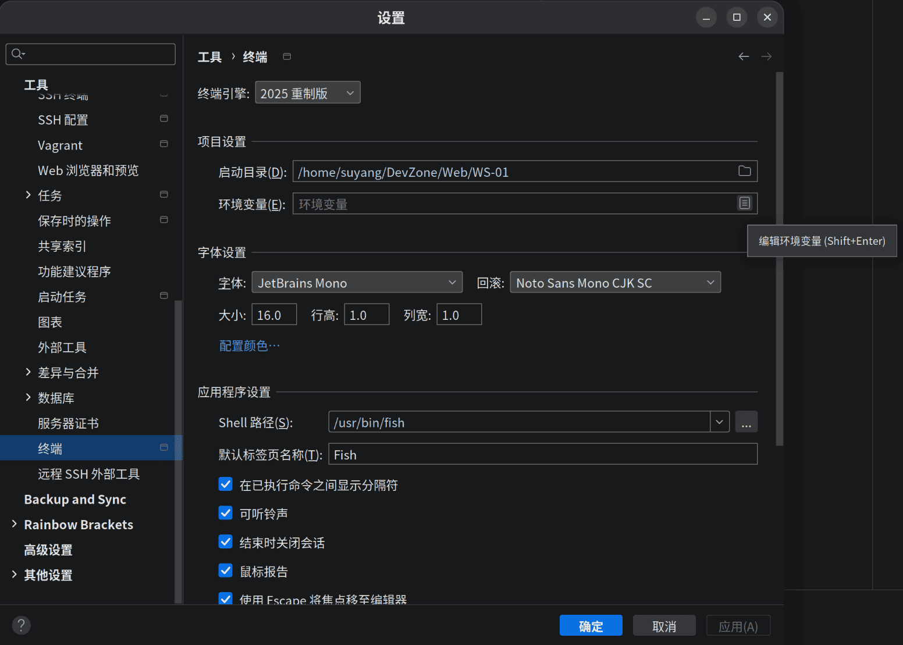
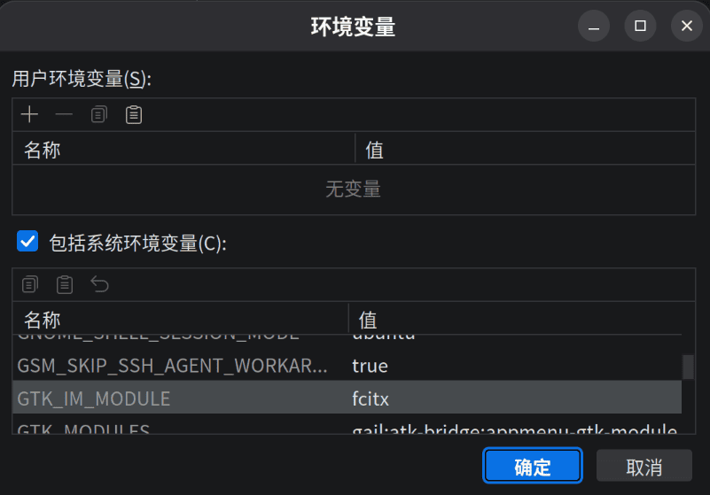
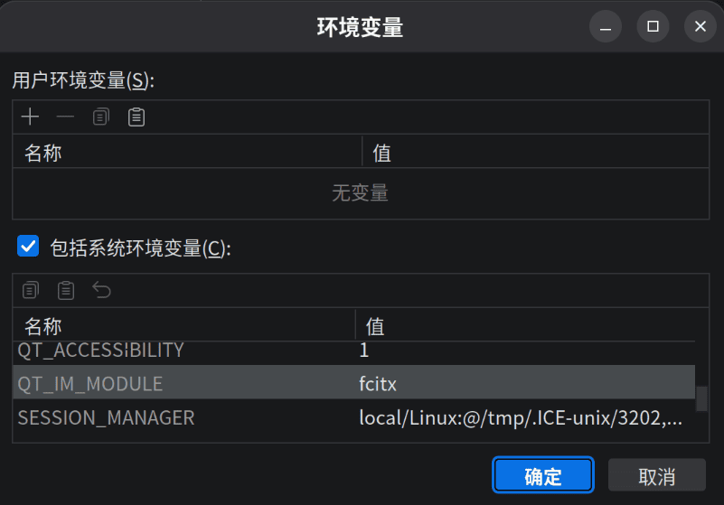
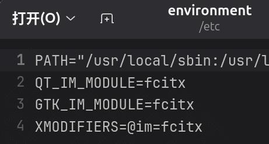
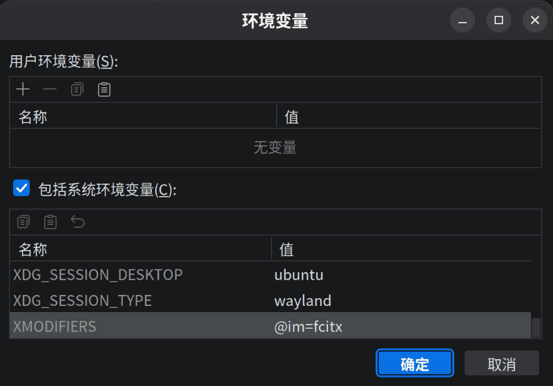

# 
使用 **Fcitx** 输入法框架

## 问题描述

截至**2025年6月16日**，JetBrains 系列软件的最新版本依然不支持**Fcitx**输入法，具体表现为无法开启中文输入状态，无论怎么弄，输入的都是英文。要搞清楚这个问题，我们可以在 JetBrains 软件中查看环境变量：

依次点击：**设置** → **工具** → **终端**，点击**环境变量**输入框右边的**编辑环境变量**按钮：

勾选**包含系统环境变量**，查看**3**个名称的值是否为 `fcitx` ：

1. `GTK_IM_MODULE`

   

2. `QT_IM_MODULE`

   

3. `XMODIFIERS`

   

从上面 3 张图片可以看出，`XMODIFIERS` 名称的值是 `@im=ibus`，问题就出在这里。

## 解决方案

简单地说就是：需要在环境变量中，指定输入法框架为**fcitx**。但是根据本人亲自测试，这个环境变量必须是**系统级**环境变量，也就是 `/etc/environment` 文件：

同时，经过测试，即使 `GTK_IM_MODULE` 和 `QT_IM_MODULE` 都设置为 `fcitx` 也没用，一定要将 `XMODIFIERS` 也设置为 `@im=fcitx`，才能在**JetBrains**软件中打开中文输入法。

因此，我们应该打开 `/etc/environment`，加入**3**条环境变量语句：

保存，然后重启操作系统，再次进入**JetBrains**软件的**编辑环境变量**中检查：

确保 `XMODIFIERS` 的值是 `@im=fcitx`，再次启动**JetBrains**软件，此时应该可以正常开启输入法了。
