# <center>Fcitx 输入法</center>

## `Linux`输入法

### `Linux`输入法现状

`Linux`输入法可分为新旧两种：

- **旧**输入法：**IBus**
  - 优点：与`GNOME`桌面环境集成度极高，在`GNOME`的`Wayland`会话下表现稳定。
  - 缺点：非`GNOME`桌面环境下体验一般，配置相对繁琐，扩展和定制能力较弱。
- **新**输入法：**Fcitx**
  - 优点：专为中文等东亚输入设计，轻量、灵活，支持丰富的皮肤和词库，对于现代桌面环境及标准协议支持极佳。
  - 缺点：老版本已逐渐停止维护，建议全面转向`Fcitx 5`。

### `Fcitx 5`需要安装哪些包？

- `fcitx5`，输入法的基础框架，必需。
- `fcitx5-chinese-addons`，中文输入法插件。
- `fcitx5-config`，图形化配置工具，在不同发行版中，可能名称有所不同，建议安装。
- `fcitx5-frontend`，前端适配器，可以提升和各种应用程序的兼容性。

### `Fcitx 5`可以通过哪些方式安装？

| 派系       | 包管理器  |
| ---------- | --------- |
| **Debian** | `apt`     |
| **红帽**   | `dnf`     |
| **Arch**   | `pacman`  |
| 通用       | `flatpak` |

## **Debian**派系安装方式：`apt`

### 搜索`fcitx5`相关包

```bash
#用正则表达式搜索，结果匹配程度更高
apt list | grep -E "包名1|包名2|包名3|……"  #"-E"参数支持扩展正则表达式

#直接用fcitx5作为关键字，匹配程度更低，搜出来的结果更多
apt list | grep fcitx5
```

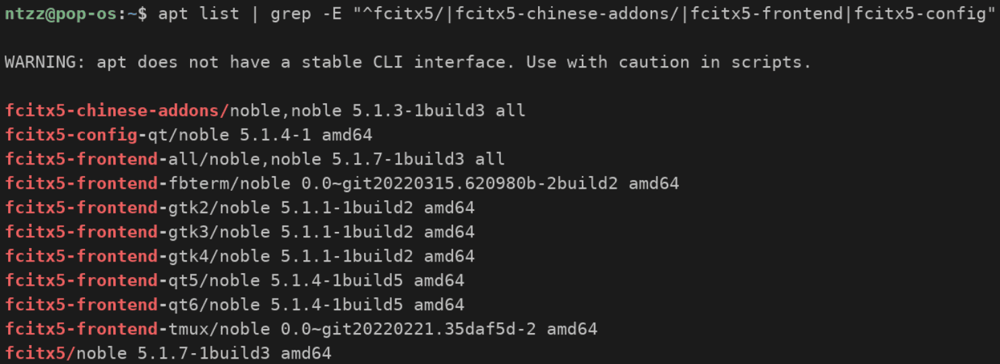

这些包名称的用途如下表：

| 包名                     | 含义                                   |
| ------------------------ | -------------------------------------- |
| `fcitx5`                 | 核心程序包，提供输入法基础框架         |
| `fcitx5-chinese-addons`  | 中文输入法插件集                       |
| `fcitx5-config-qt`       | 基于`Qt`的`Fcitx 5`图形化配置工具      |
| `fcitx5-frontend-all`    | 全部前端适配器（**包含了下面所有行**） |
| `fcitx5-frontend-fbterm` | 面向`fbterm`终端模拟器的前端适配器     |
| `fcitx5-frontend-gtk2`   | `GTK2`应用程序的前端适配器             |
| `fcitx5-frontend-gtk3`   | `GTK3`应用程序的前端适配器             |
| `fcitx5-frontend-gtk4`   | `GTK4`应用程序的前端适配器             |
| `fcitx5-frontend-qt5`    | `Qt5`应用程序的前端适配器              |
| `fcitx5-frontend-qt6`    | `Qt6`应用程序的前端适配器              |
| `fcitx5-frontend-tmux`   | 面向`tmux`终端复用器的前端适配器       |

### 安装`fcitx5`相关包

```bash
sudo apt install 包名1 包名2 包名3 ……
```

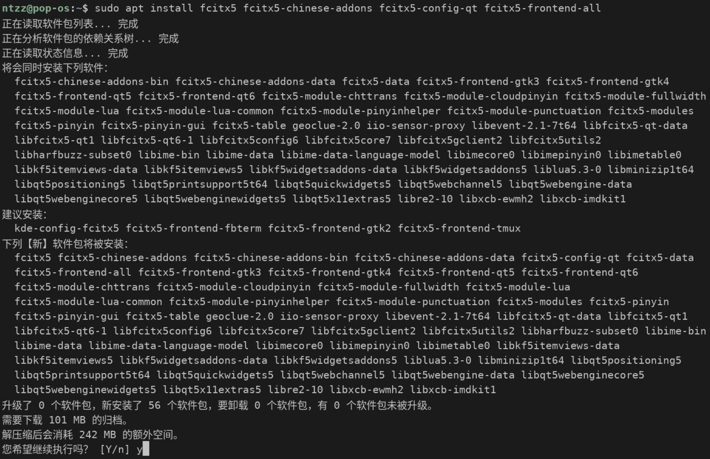

## **红帽**派系安装方式：`dnf`

遗憾的是，本人在`Rocky Linux 10.2`中，通过`dnf search 包名`的方式，无法搜索到`fcitx5`相关的包。  
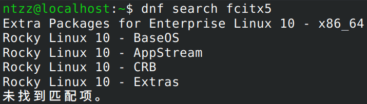

本人更新了系统、更新了仓库、刷新了缓存，依然无法找到相关包。  
不过，**红帽**派系依然可以通过`flatpak`的方式进行安装，`flatpak`本身也需要安装：

```bash
sudo dnf install flatpak  #安装"flatpak"自身
```

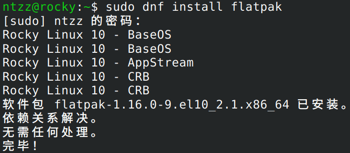

后续步骤可参考[通用安装方式：Fcitx 5](/Markdown-Notes/?技术栈=Linux&笔记=Fcitx输入法#目录-1-5)。

## **Arch**派系安装方式：`pacman`

### 搜索`fcitx5`相关包

```bash
pacman -Ss 包名
```

如图所示，`pacman`搜索`fcitx5`的结果非常多，图中只列出了一部分：

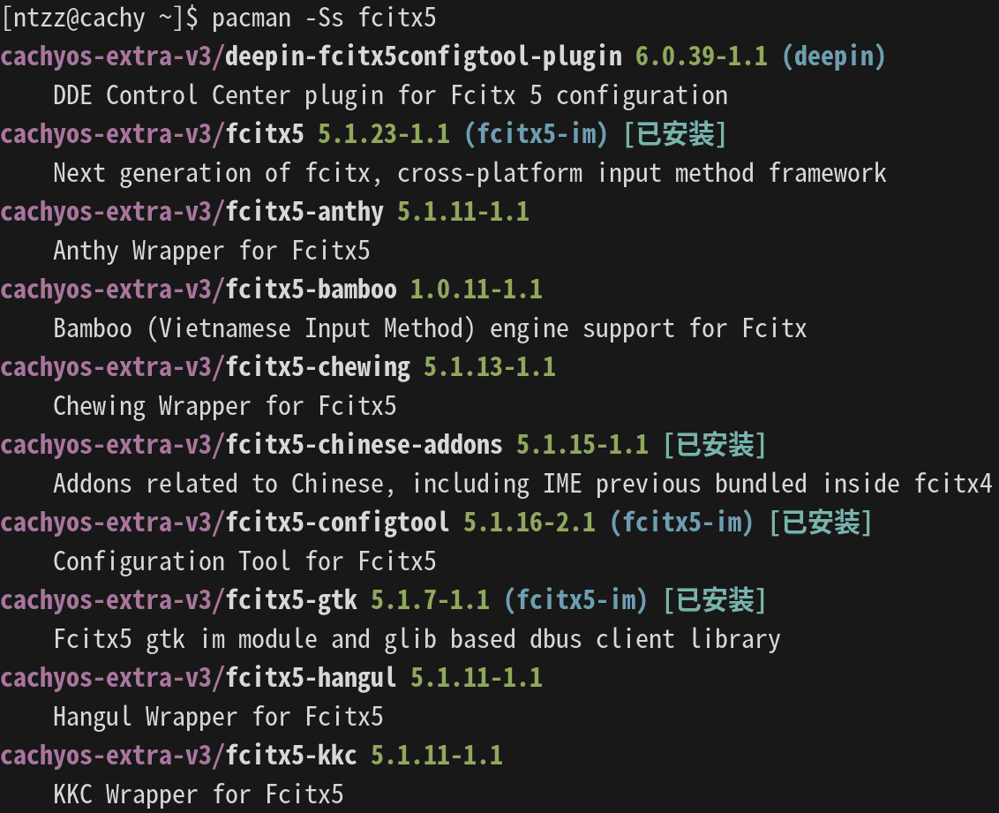

### 安装`fcitx5`相关包

虽然`pacman`搜索`fcitx5`会得到很多结果，但实际上我们需要安装的就`2`个:

- `fci5x5-im`：一组包，包含了输入法框架和配置工具
- `fcitx5-chinese-addons`：中文输入法插件集

```bash
sudo pacman -S fcitx5-im fcitx5-chinese-addons  #fcitx5-im是一组，内含多个包
```

运行结果如下图，直接回车即可安装所有`4`个包：

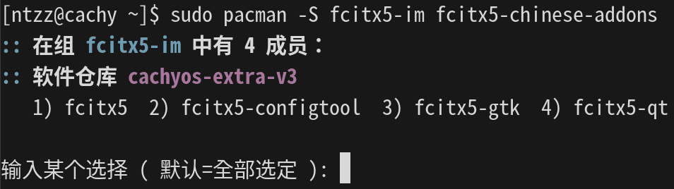

## **通用**安装方式：`flatpak`

### 安装`flatpak`自身，并添加仓库地址

- 相关操作请参考：<a href="/Blogs/?tech=Linux&article=通用软件包#三级标题-3-1" target="_blank">安装并配置 flatpak</a>，完成其中的`3-1`、`3-2`、`3-3`三步。

### 安装`Fcitx 5`

访问<a href="https://flathub.org/zh-Hans/apps/org.fcitx.Fcitx5" target="_blank">flathub页面</a>，点击**安装**按钮旁边的三角箭头，获得安装命令：

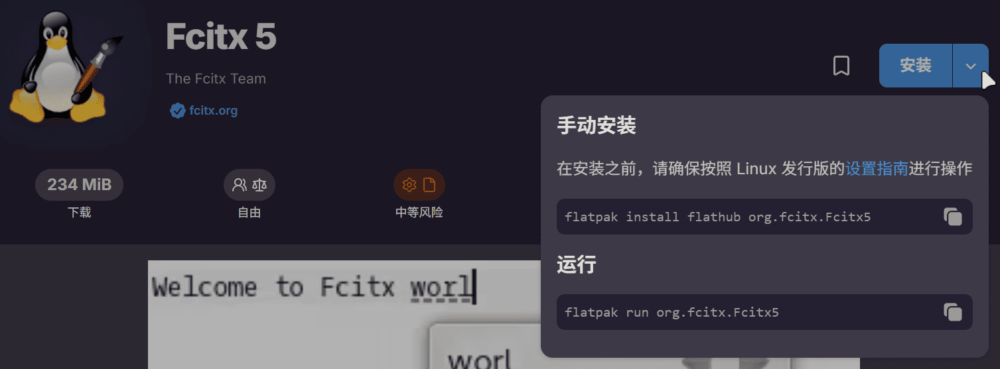

将**手动安装**的命令复制到终端，执行：

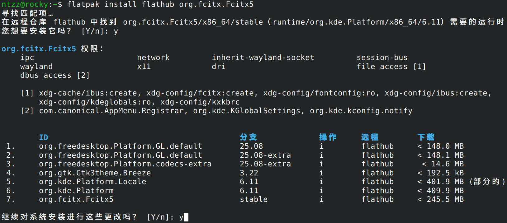

### 安装`Fcitx 5`中文输入法插件集

在同一页面向下滚动，可以找到**附加组件**中的**Chinese Addons**，点击其右边的**安装**按钮，可获得安装命令：

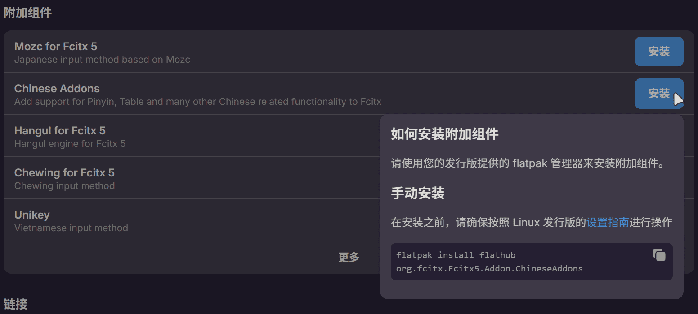

将**手动安装**的命令复制到终端，执行：

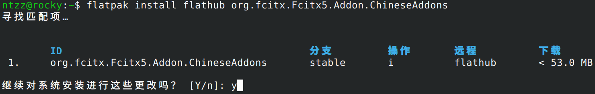

## 启动`Fcitx 5`

### **虚拟键盘**启动法

在**KDE**桌面环境中，我们可以在**虚拟键盘**选项里，切换到`Fcitx 5`，即可将其设置为默认输入框架并启动。

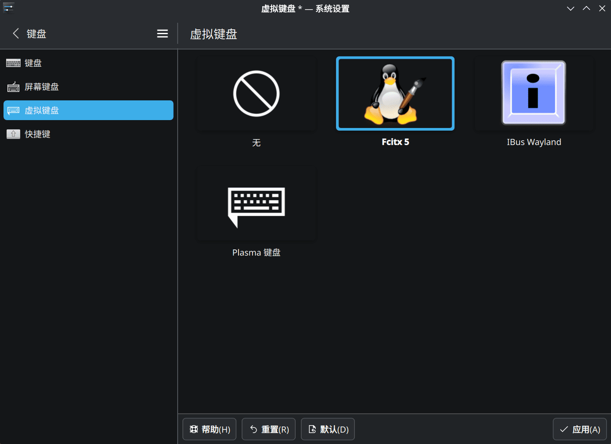

### **图形化配置**启动法

有的桌面环境中，没有**虚拟键盘**这一项，可以在程序列表中，找到`Fcitx 5 配置`，运行此程序：

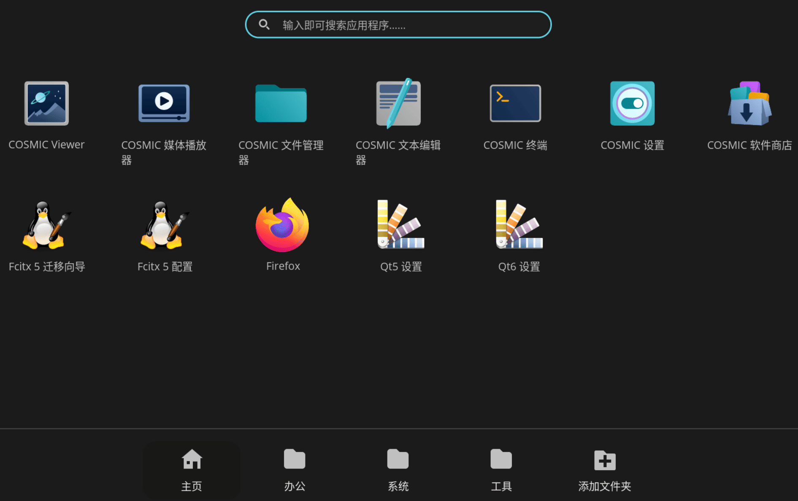

如果`Fcitx 5`本身尚未运行，则会看到这样的界面：

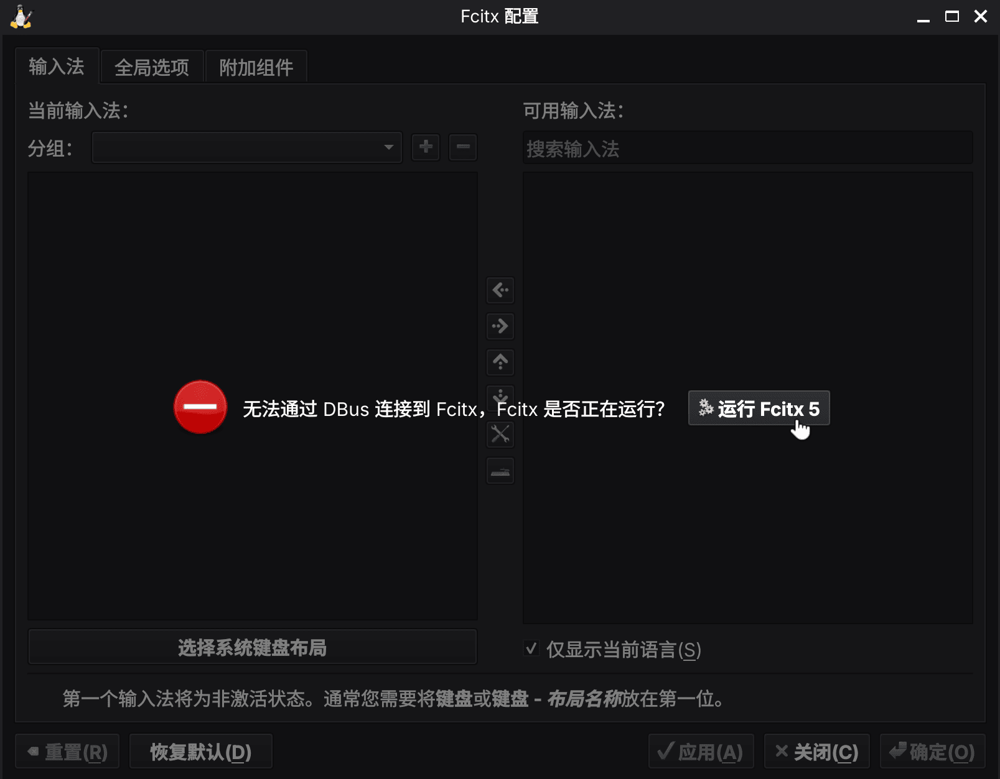

直接点击`运行 Fcitx 5`即可

### 配置`Fcitx 5`

运行`Fcitx 5`之后，会在桌面环境托盘中看到键盘图标，右击托盘可以弹出相应菜单：

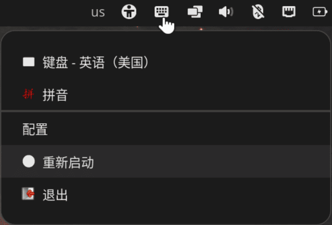

此时`Fcitx 5 配置`会显示如下界面：

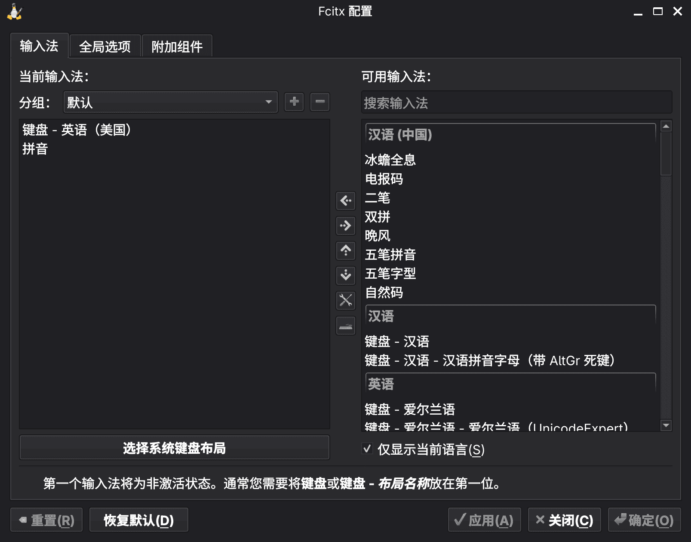

我们要做的就是添加自己喜欢的输入法。切换输入法的默认快捷键是`Ctrl + 空格`。
