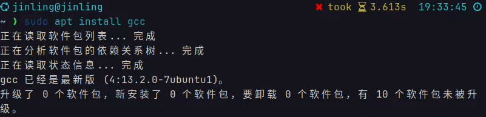
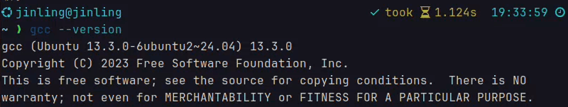
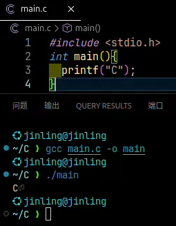
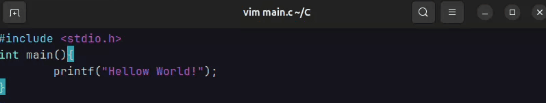
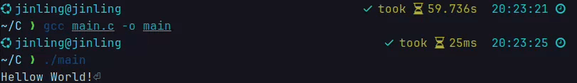

# Linux下载gcc

## 下载gcc

* 和Windows相比，在Linux系统上装gcc要容易一些
* 在终端输入如下代码

  ```
  sudo apt install gcc
  ```



## 检查gcc安装

* gcc装完后可以通过以下命令检查是否安装成功
* 在终端输入如下代码

  ```
  gcc --version
  ```



* 如果出现出现错误信息，说明gcc没有安装成功

## 使用gcc编译

* 可以在VScode中新建.c源文件，用gcc进行编译

  ```
  gcc main.c -o main
  ```



* 或者在终端里用vim编写源文件，再用gcc进行编译





* 但是这边请确保源文件位于当前工作目录，以避免路径错误。
