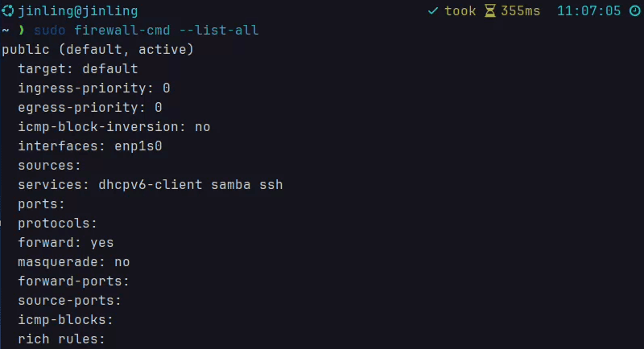
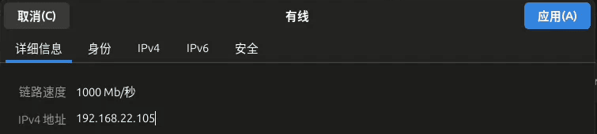
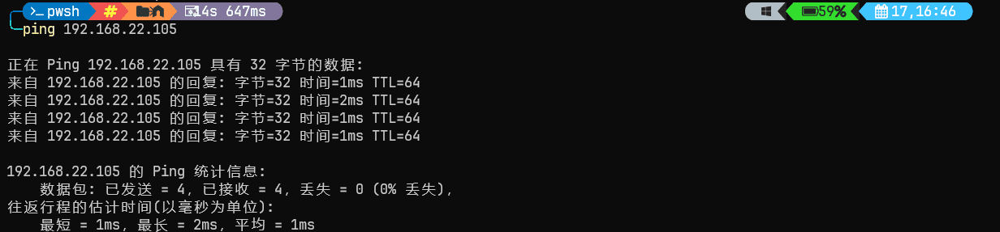
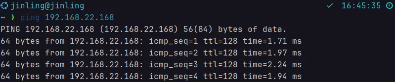
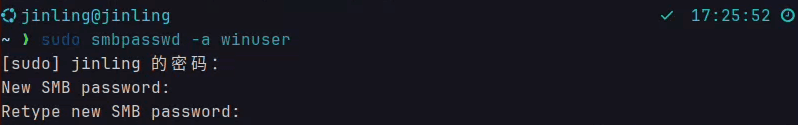
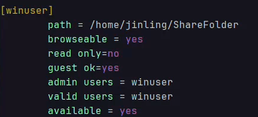
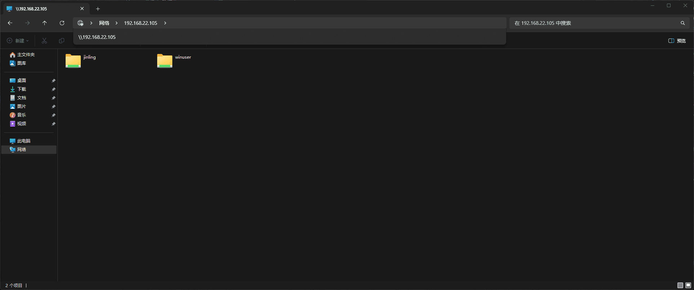

# <center>Samba </center>

## 下载Samba

* 可以使用 `apt` 命令下载 `Samba`

  ```
  sudo apt install samba
  ```

## 准备工作

### 防火墙

* 如果你电脑上装有 `firewalld` 防火墙，你需要为 `Samba` 添加相应的防火墙规则
* 将 `Samba` 服务添加 `firewalld` 的永久配置中

  ```
  sudo firewall-cmd --permanent --add-service=samba
  ```

  
* 重新加载 `firwalld` 配置

  ```
  sudo firewall-cmd --reload
  ```
* 检查 Samba 服务是否已经成功添加

  ```
  sudo firewall-cmd --list-all
  ```

  
* 看见 `services` 中有 `samba` 字段，说明 `Samba` 服务已经添加到 `firewalld` 的规则中

### 网络配置检查

* 确保两台设备都在同一网段内,并且可以 `ping` 通
* 在Linux电脑上可以直接在设置里看到自己的IP地址

  
* 接着,在另一台Windows设备的中终端中尝试  `ping` 通该IP地址已验证网络的连接

  
* 建议还需要在Linux电脑上 `ping` 通这台Windows设备的IP地址，可以使用 `ipconfig` 来查看Windows设备的IP地址

  
* 这样子就可以确认网络已经连接成功

### Samba配置

* 创建一个文件夹用来存放要传输的文件，并且确保这个文件夹的权限足够我们读写

  
* 接下来创建Samba用户，注意 `这个用户必须在Linux系统上已经存在 `
* 先创建一个Linux用户:

  ```
  sudo useradd winuser
  ```

  
* 然后创建Samba用户

  ```
  sudo smbpasswd -a winuser
  ```

  
* 现在需要修改Samba配置文件，让这个Samba用户和文件夹运作起来
* Samba的配置文件在 `/etc/samba` 目录下，文件名为 `smb.conf`
* 添加以下配置

  
* `path = /home/jinling/share`: 指定共享文件夹的实际路径，这里是 `/home/jinling/share`
* `browseable = yes`: 设置为 `yes` 表示该共享文件夹将在网络邻居中可见
* `read only = no`: 设置为 `no` 表示该共享文件夹是可写的，用户可以写入文件
* `guest ok = yes`: 设置为 `yes` 表示访客（未经过身份验证的用户）可以访问该共享文件夹
* `admin users = winuser`: 指定可以管理该共享文件夹的用户。`winuser` 用户将拥有对该共享文件夹的完全控制权，包括创建、删除和更改文件和文件夹的权限
* `valid users = winuser`: 指定可以访问该共享文件夹的用户。只有 `winuser` 用户才能访问该共享文件夹
* `available = yes`: 设置为 `yes` 表示该共享文件夹可用。如果设置为 `no`，则该共享文件夹将被禁用，用户无法访问	

## 使用Samba

* 打开Windows的文件资源管理器，在地址栏中输入Linux设备的IP地址，格式如下

  ```
  \\192.168.22.105
  ```

  

* 在这里就会看到刚刚创建的共享文件夹winuser，双击登录，然后就可以把想要共享的文件放在这个文件夹里了
