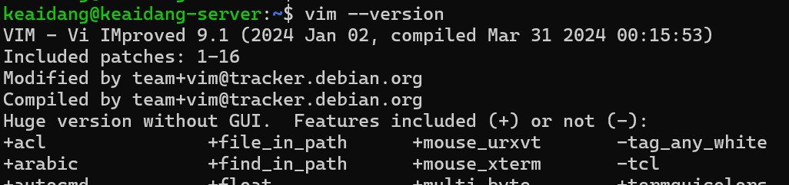
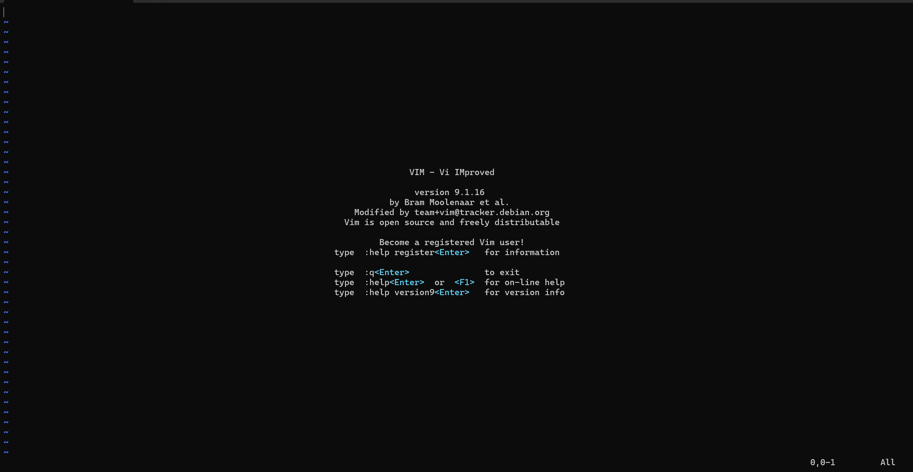

# <center>Vim 使用教程</center>

## Vim 是什么

在介绍如何使用 Vim 编辑器之前，先弄清楚它究竟是什么。简单来说，Vim 是一个功能强大的文本编辑器，其前身是 Vi。Vi 由 Bill Joy 于 1976 年在 Unix 系统上开发，是 Unix 世界的标准文本编辑器，几乎所有类 Unix 系统（包括 Linux、macOS）都预装了它。

Vim 的核心理念是：

> 在不离开键盘的情况下高效编辑文本。

## Vim 相比 Vi 的改进

作为 Vi 的升级版本，Vim 在许多方面做了大幅提升。下表对两者进行了直观的对比：

| 对比项           | **Vi**               | **Vim**                        |
| :--------------- | :------------------- | :----------------------------- |
| **全称**         | Visual Editor        | Vi Improved（Vi 的改进版）     |
| **诞生时间**     | 1976 年，由 Bill Joy 开发 | 1991 年，由 Bram Moolenaar 开发 |
| **来源**         | Unix 系统自带        | 从 Vi 改进而来                 |
| **功能定位**     | 基本文本编辑器        | 高级、可扩展的文本编辑器       |
| **语法高亮**     | ❌ 不支持             | ✅ 支持多语言语法高亮          |
| **多文件/多窗口编辑** | ❌ 不支持         | ✅ 支持 `:split`、`:vsplit` 分屏操作 |
| **撤销功能**     | 只能撤销一步          | 可多步撤销（撤销树）           |
| **搜索与替换**   | 基本功能              | 增强搜索（支持正则表达式、高亮显示） |
| **插件系统**     | ❌ 无                 | ✅ 强大的插件系统（如 NERDTree、coc.nvim） |
| **配置文件**     | 固定、不可扩展        | 可通过 `.vimrc` 配置，灵活自定义 |
| **代码折叠**     | ❌ 不支持             | ✅ 支持折叠（fold）功能         |
| **鼠标支持**     | ❌ 不支持             | ✅ 可启用鼠标支持              |
| **图形界面**     | 无                    | 有 GVim（图形界面版本）        |
| **兼容性**       | 基本 Unix 系统内置    | 完全兼容 Vi，且功能更多        |
| **社区与支持**   | 几乎无更新            | 活跃社区、持续更新（衍生出 Neovim） |

从对比中可以看出，Vim 比 Vi 更加主流、通用，已经成为大多数 Linux 系统上的默认“万能”编辑器。

## Vim 与 Nano 的定位

不可否认，Vim 的操作逻辑对初学者来说比较陡峭，因此不少人更偏爱界面友好的 Nano 编辑器。不过，Vim 在效率和扩展性方面仍有明显优势：

| 编辑器                   | 简介                         | 适用人群                    |
| :----------------------- | :--------------------------- | :--------------------------- |
| **Vim (Vi Improved)**    | 专业级、模式化的文本编辑器，强调键盘效率与可扩展性。 | 程序员、系统管理员、需要高效率文本编辑的用户。 |
| **Nano**                 | 简单易用的命令行文本编辑器，无需记忆复杂命令。    | 初学者、临时修改配置文件的用户。        |

## 使用教程

### （一）查看版本确保您的系统中安装了vim编辑器

几乎所有现代 Linux 发行版都包含 Vim（或至少包含与 Vim 兼容的 Vi 版本），但并非 所有 发行版默认安装完整的 Vim 包。



如图的显示已经给出了版本信息

含义：

- VIM - Vi IMproved 9.1：表示你安装的是 Vim 9.1 版本。
- 这是目前（截至 2025 年）较新的稳定版本之一。
- (2024 Jan 02)：该版本的正式发布日期。
- compiled Mar 31 2024：说明这个 Vim 是在 2024 年 3 月 31 日编译（打包）到系统中的。
- Included patches: 1-16：表示此版本已包含从补丁 1 到 16 的官方修复更新。

### （二）vim的基本界面

启动 Vim 后的基本界面结构

当你在终端中输入：

```bash
vim
```

或者

```bash
vim 文件名
```


就会进入 Vim 的主界面。如上图所示整体可以分为以下几个部分：

```
┌──────────────────────────────────────────────┐
│ 文件内容显示区（编辑区）                    │
│----------------------------------------------│
│ ~                                            │
│ ~                                            │
│ ~  （波浪线表示未使用的空行）               │
│----------------------------------------------│
│ 状态栏（Status Line）                        │
│----------------------------------------------│
│ 命令行区域（Command Line Area）              │
└──────────────────────────────────────────────┘
```

* * *

### （三）Vim 的三种主要模式

Vim 与其他文本编辑器（如 Nano 或 Notepad）的一大区别是，它采用“**模式编辑**”的方式。

这意味着在 Vim 中，键盘输入的行为会根据当前所处的模式不同而完全改变。

| 模式       | 英文名称             | 进入方式         | 功能说明                 |
| :--------- | :------------------- | :--------------- | :----------------------- |
| **普通模式** | Normal Mode        | 启动时默认进入   | 用于浏览、删除、复制、粘贴、移动等操作。 |
| **插入模式** | Insert Mode        | 在普通模式下按 `i` | 可以像普通编辑器一样输入文字。 |
| **命令模式** | Command-Line Mode  | 在普通模式下按 `:` | 输入保存、退出、查找、替换等命令。 |

模式切换逻辑如下：

- 普通模式 → 插入模式：按 `i`
- 插入模式 → 普通模式：按 `Esc`
- 普通模式 → 命令模式：按 `:`

当你在屏幕底部看到提示：

- `-- INSERT --`：说明你正在编辑文字；
- `:` 出现时：说明你在输入命令；
- 没有任何提示：说明你回到了普通模式。

* * *

### （四）Vim 基本操作命令

入门，掌握这些命令后，你已经可以在 Vim 中完成日常的文本编辑工作了。

虽然我很难相信正常人会日常用vim编辑文本，但是vim让人又爱又恨，爱的人觉得他是世界上最好的编辑器，恨的人在发现使用curl+c或esc怎么都退出不了编辑器后，关闭了终端发誓再也不用这个鬼东西。

#### 1️⃣ 文件操作

| 操作     | 命令              | 说明                 |
| :------- | :---------------- | :------------------- |
| 打开文件 | `vim 文件名`        | 若文件不存在则会新建 |
| 保存文件 | `:w`              | 保存当前修改         |
| 退出     | `:q`              | 若无修改则退出       |
| 强制退出 | `:q!`             | 放弃修改直接退出（不保存） |
| 保存并退出 | `:wq` 或 `:x`     | 最常用的退出命令     |
| 打开多个文件 | `vim file1 file2` | 使用 `:n` 和 `:N` 在文件间切换 |

#### 2️⃣ 插入文本

| 操作                     | 命令 | 说明       |
| :----------------------- | :--- | :--------- |
| 在光标前插入             | `i`  | 最常用     |
| 在光标后插入             | `a`  | append（追加） |
| 在当前行首插入           | `I`  | 大写 I     |
| 在当前行末插入           | `A`  | 大写 A     |
| 在下一行新建一行并进入插入模式 | `o`  | open 新行 |
| 在上一行新建一行并进入插入模式 | `O`  | 大写 O     |

* * *

### （五）光标移动与浏览（普通模式下）

需要注意的是，Vim 通过不同模式来区分是输入字符还是使用按键控制编辑器。如果在插入模式中上一笔输入错误，应先按 `Esc` 退出到普通模式，再按 `u` 撤销上一步操作。

在 Vim 中，使用方向键可以移动光标，但更推荐使用键盘上的 **`h j k l`** 四个键：

| 按键 | 功能     |
| :--- | :------- |
| `h`  | 向左移动 |
| `j`  | 向下移动 |
| `k`  | 向上移动 |
| `l`  | 向右移动 |

其他常用移动命令：

| 命令     | 作用                           |
| :------- | :----------------------------- |
| `0`      | 移动到行首                     |
| `$`      | 移动到行尾                     |
| `gg`     | 跳转到文件开头                 |
| `G`      | 跳转到文件末尾                 |
| `:n`     | 跳转到第 n 行（如 `:10` 跳到第 10 行） |
| `Ctrl + f` | 向下翻页                     |
| `Ctrl + b` | 向上翻页                     |

* * *

### （六）删除、复制、粘贴与撤销

| 操作     | 命令       | 说明                   |
| :------- | :--------- | :--------------------- |
| 删除一个字符 | `x`         | 相当于删除键             |
| 删除一整行 | `dd`        | 删除光标所在行           |
| 删除多行   | `ndd`       | 删除 n 行（如 `3dd` 删除 3 行） |
| 复制当前行 | `yy`        | yank（复制）            |
| 复制多行   | `nyy`       | 复制 n 行               |
| 粘贴     | `p`         | 在光标后粘贴             |
| 撤销操作   | `u`         | 撤销上一步               |
| 重做操作   | `Ctrl + r`  | 恢复被撤销的操作         |

* * *

### （七）搜索与替换

#### 1️⃣ 搜索文本

| 操作   | 命令     | 说明       |
| :----- | :------- | :--------- |
| 向下搜索 | `/关键字` | 按回车后开始搜索 |
| 向上搜索 | `?关键字` | 从光标向上查找 |
| 下一个匹配 | `n`     | 向下查找下一个 |
| 上一个匹配 | `N`     | 向上查找上一个 |

#### 2️⃣ 替换文本

| 操作       | 命令           | 说明             |
| :--------- | :------------- | :--------------- |
| 当前行替换   | `:s/旧/新/`      | 只替换第一个匹配项 |
| 当前行全部替换 | `:s/旧/新/g`    | 替换整行所有匹配项 |
| 全文替换     | `:%s/旧/新/g`   | 替换整个文件所有匹配项 |
| 全文确认替换 | `:%s/旧/新/gc`  | 每次替换前询问是否确认 |

* * *

### （八）显示与界面设置

为了让 Vim 更好用、更直观，可以开启一些显示功能：

```vim
:set number       " 显示行号
:set ruler        " 显示光标所在行列
:set showmode     " 显示当前模式
:set showcmd      " 显示输入的命令
:set cursorline   " 高亮当前行
:set tabstop=4    " 设置 Tab 为 4 个空格
```

这些设置可以写入配置文件 `~/.vimrc` 中，这样每次打开 Vim 都会自动生效。

* * *

### （九）退出 Vim 的正确方式

| 操作     | 命令           | 含义         |
| :------- | :------------- | :----------- |
| 保存文件 | `:w`           | 写入文件但不退出 |
| 退出 Vim | `:q`           | 若未修改则退出 |
| 保存并退出 | `:wq` 或 `:x` | 保存修改并退出 |
| 放弃修改退出 | `:q!`         | 不保存直接退出 |
| 保存为新文件 | `:w 文件名`    | 另存为       |

> ⚠️ **新手误区**：很多人第一次打开 Vim 后不知道怎么退出，其实只要按 `Esc` → `输入命令` → 回车 即可。

* * *

### （十）实用技巧与练习建议

1. **使用内置教程**

   在终端中输入：

   ```bash
   vimtutor
   ```

   这是官方交互式教程，非常适合新手边练边学。

2. **多动手练习**

   熟练 Vim 唯一的秘诀就是——**实践**。

   每天花 10 分钟编辑文件，你会很快熟悉命令。

3. **逐步配置个性化**

   学会后可以研究 `~/.vimrc` 文件，自定义颜色、高亮、快捷键。

4. **升级体验**

   尝试使用 **Neovim**，它是 Vim 的现代化分支，速度更快、插件更多。

* * *

## 总结一下

| 主题           | 内容                                   |
| :------------- | :------------------------------------- |
| **Vim 核心理念** | 纯键盘操作、高效编辑                     |
| **三种模式**     | 普通模式、插入模式、命令模式             |
| **关键命令**     | `i` 插入、`Esc` 退出、`:wq` 保存退出 |
| **适合人群**     | 程序员、系统管理员、进阶 Linux 用户      |
| **入门路径**     | 通过 `vimtutor` 练习 + 配置 `.vimrc` 个性化设置 |

* * *

🧠 **鲁迅说过：**

> Vim 学起来像登山，但登上山顶后，你会发现所有的文本编辑器都在脚下。
