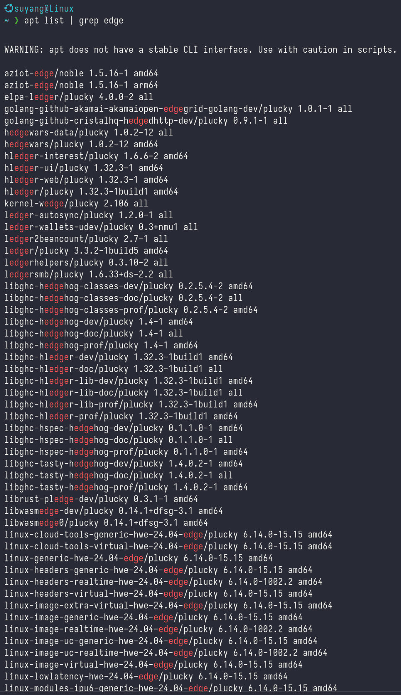
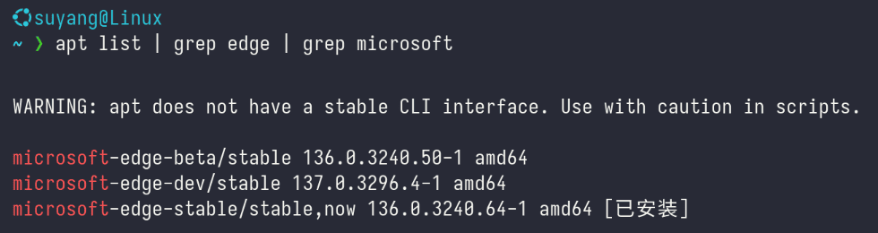

# 
`apt` 查找软件包

## `apt` 软件包名称
`apt` 软件包的名称往往和软件自身的名称不一样，用软件自身的名称进行安装是没用的。比如：想装 `QQ`，如果直接输入 `sudo apt install qq`，会出现：

实际上软件对应的包名称都和软件名称不同：
- `Edge` 包名称：`microsoft-edge-stable`
- `QQ` 包名称：`linuxqq`
  
因此，我们需要用 `apt list` 命令，来列出需要的软件包名称。
## `apt list` 用法
- `apt` 包含大量的包，直接用 `apt list`，会列出所有的包名称，数量超过 `75000`，因此，我们需要对结果进行筛选。
- 如果已经用了 `apt list`，可以按 `q` 退出该命令。
- 使用 `|` 和 `grep` 进行筛选
  - `|` 叫**管道符**，作用是连接多个命令，前一个命令的结果作为后一个命令的输入。
  - `grep` 是文本搜索命令
## 案例：
比如，我知道浏览器的名字叫 `Edge`，但是不知道包的名字，那么可以通过 `| grep edge` 过滤结果：
- `apt list | grep edge`

  
  列出的包数量从 `70000` 多减少到了数十个，但还是太多。如果对于浏览器常识有所了解，应该知道 `Edge` 浏览器是 `Microsoft` 公司的产品，因此，在数十个结果中再次进行筛选。
- `apt list | grep edge | grep microsoft`

  
  非常好！这回只有 `3` 个结果。仔细看可以发现，`Edge` 浏览器分为3个分支：
  - `beta`：公开测试分支
  - `dev`：开发分支
  - `stable`：稳定分支
  
  没有什么特殊需求，我们就用稳定分支，因此我们需要的软件包名称就是：`microsoft-edge-stable`。
    
  在终端运行：`sudo apt install microsoft-edge-stable` 以安装此软件。
