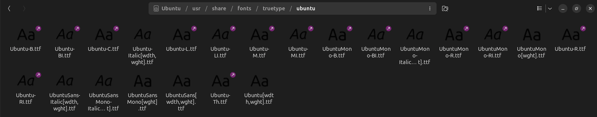
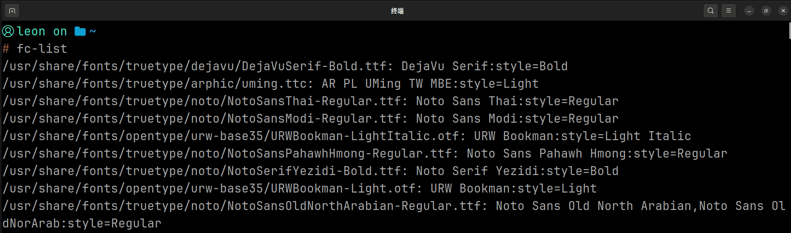
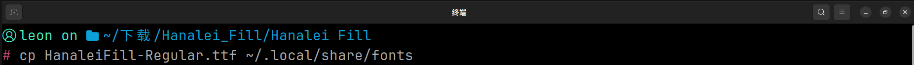
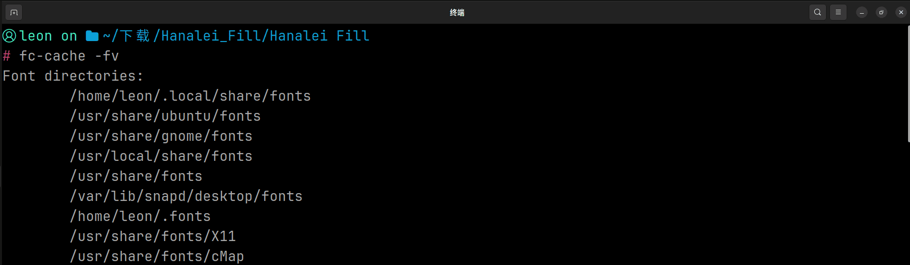
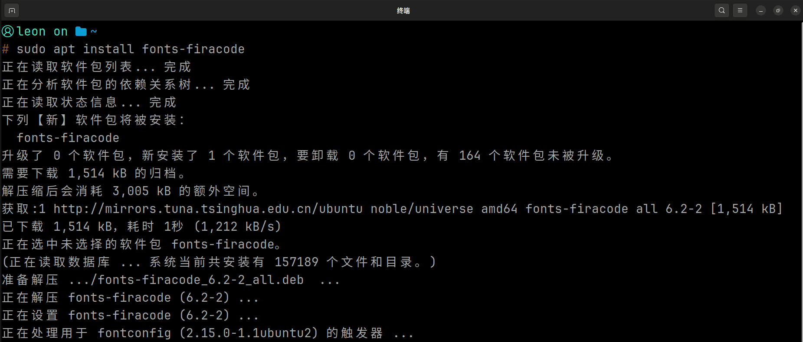
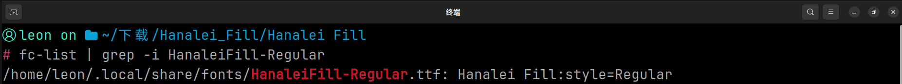

# <center>字体 </center>

## 什么是字体

> **字体（Font）** 是用于描述文字外观的一类数据文件，它决定了文字在计算机上的**形状、粗细、大小以及其他视觉特征**

## 认识字体文件

在 Linux 系统中，字体并非抽象概念，是以 **字体文件（Font File）** 的形式存储在文件系统中。

|  扩展名  | 文件格式                   | 简介                                                                                               |
| :------: | :------------------------- | :------------------------------------------------------------------------------------------------- |
|  `.ttf`  | **TrueType Font**          | 应用最广泛的字体格式之一，具有良好的兼容性，广泛应用于 Windows、Linux 等操作系统。                 |
|  `.otf`  | **OpenType Font**          | 现代字体格式之一，在 TrueType 与 PostScript 技术基础上发展而来，支持更加丰富的字体排版与字符特性。 |
|  `.ttc`  | **TrueType Collection**    | 字体集合格式，可以在单个文件中封装多个字体，常用于包含多个字体或字体样式的场景。                   |
| `.woff`  | **Web Open Font Format**   | 面向 Web 环境设计的字体格式，经过针对网络传输的优化，主要用于网页字体加载。                        |
| `.woff2` | **Web Open Font Format 2** | WOFF 的新一代格式，采用更加高效的压缩方式，能够进一步减少字体文件体积，主要用于现代 Web 字体。     |

## 查看已经安装的字体

### 方法 1：通过文件管理器查看

在 Ubuntu 系统中，系统全局字体通常存放在 `/usr/share/fonts/` 目录下。

下图展示 Ubuntu 系统中的部分自带字体：



### 方法 2：使用 Shell 命令查看

也可以使用 Shell 命令查看系统已安装字体：

```bash
fc-list
fc-list :lang=zh    # 只列出中文字体
fc-list | less      # 分页浏览全部字体
```



## 安装字体

在 Ubuntu 中，安装字体主要有两种方式：

- **将字体文件复制到用户字体目录**，适合安装单个字体文件。
- **使用包管理器安装**，适合安装软件源中的字体包。

### 方法 1：复制到用户字体目录

将字体文件复制到用户字体目录 `~/.local/share/fonts/`，安装的字体仅对当前用户生效，**无需管理员权限**。

```bash
cp 字体文件.ttf ~/.local/share/fonts/
```



复制完成后，更新系统字体缓存：

```bash
fc-cache -fv
```



### 方法 2：使用包管理器安装

Ubuntu 软件源中提供了许多常用的字体包，可以直接使用 `apt` 进行安装。

例如安装 Fira Code 字体：

```bash
sudo apt install fonts-firacode
```



安装完成后，系统会**自动更新字体缓存**。

其他常用字体包示例：

```bash
sudo apt install fonts-noto-cjk
sudo apt install fonts-noto-mono
sudo apt install fonts-dejavu-core
```

## 验证

安装完成后，可以使用以下命令查看字体是否已被系统识别：

```bash
fc-list | grep -i "字体名称"
```



如果输出中包含字体名称或字体文件路径，说明字体安装成功。
