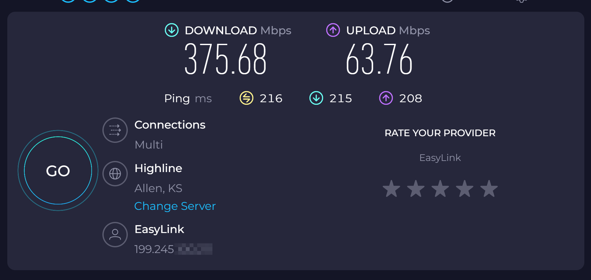

# <center>**开启BBR**</center>

# [BBR](https://zh.wikipedia.org/wiki/TCP%E6%8B%A5%E5%A1%9E%E6%8E%A7%E5%88%B6)是什么？

**BBR TCP拥塞控制**是传输控制协议，避免网络拥塞的算法，是互联网上主要的一个拥塞控制措施。它使用一套基于线增积减模式的多样化网络拥塞控制方法（包括慢启动和拥塞窗口等模式）来控制拥塞。在互联网上应用中有相当多的具体实现算法。

❗需要注意的是BBR是传输层协议需要Linux内核支持。
❗bbr的主要作用在发送方，如需优化双向链路请在发送和接收端同时启用。
## BBR vs 传统算法对比

相比于传统的的拥塞控制算法（CUBIC）的优势

| **对比维度** | **BBR** | **传统算法（CUBIC/Reno）** |
| --- | --- | --- |
| **拥塞信号** | 基于带宽和最小 RTT 模型 | 基于丢包（AIMD） |
| **带宽利用率** | 高，尤其在高带宽、高延迟链路 | 收敛慢，利用率低 |
| **排队延迟** | 低，避免 Bufferbloat | 高，容易产生长队列 |
| **收敛速度** | 快，能迅速适应带宽变化 | 慢，需要多次丢包恢复 |
| **丢包敏感性** | 不敏感，丢包不等于拥塞 | 高，随机丢包会导致速率下降 |
| **适用场景** | 高带宽、高 RTT、无线网络 | 传统互联网环境 |

## BBR 的常见作用

### **✅ BBR 的常见作用**

1. **提高链路带宽利用率**
    - 在高带宽、高延迟网络中，BBR 能快速达到接近链路容量的速率，避免传统算法的收敛慢问题。
2. **降低网络延迟（缓解 Bufferbloat）**
    - 通过控制发送速率，避免过度填充路由器队列，显著降低排队延迟，提升实时应用体验（如视频会议、在线游戏）。
3. **改善高丢包环境性能**
    - 在无线网络或跨境链路中，BBR 不会因随机丢包过度降速，保持稳定吞吐。
4. **优化长距离传输**
    - 对于跨洲际、大 RTT 的链路，BBR 能快速收敛，适合 CDN、云服务、跨境数据传输。
5. **提升大流量应用性能**
    - 适用于视频流媒体、文件分发、云备份等需要高吞吐的业务。
6. **减少速率波动**
    - 通过带宽和 RTT 模型，避免传统算法因丢包导致的速率剧烈波动，提升连接稳定性。

## 实际应用场景

实际应用上例如 
 - 在高峰期使用跨国代理，可以开启bbr利用bbr的特性缓解我国骨干网的qos和丢包问题。
 - 缓解运营商目前跨网，跨省的qos策略，提升网站的访问速度，提高业务可用性。

bbr在**CDN 加速（内容分发网络），云存储与备份，视频流媒体中亦有广泛应用**

## 关于 fq

`fq` 是 **Fair Queueing（公平队列调度器）** 的简称，是 Linux 内核中的一种 **包调度算法（qdisc）**，根据速率控制（pacing）精确调度数据包。常与 BBR 搭配使用，因为**BBR 依赖精确的 速率控制**

以下操作将开启bbr+fq

## 如何在linux下开启bbr？

### 一、临时开启（重启失效）

#### 1. 检查内核版本

要注意的是 BBR 最初在 Linux 4.9 引入，旧版本内核没有该算法，需要升级或打补丁。

```bash
uname -r
```


#### 2. 查看当前支持的拥塞控制算法

确认其中包含bbr

```bash
sysctl net.ipv4.tcp_available_congestion_control
```


#### 3. 启用bbr

root权限运行！
```bash
sysctl -w net.ipv4.tcp_congestion_control=bbr
```


#### 4. 设置默认队列调度器为 fq

```bash
sudo sysctl -w net.core.default_qdisc=fq
```


### 二、持久化开启

#### 1. 使用root权限编辑 `/etc/sysctl.conf`

以下使用nano编辑器，可使用任意编辑器：

```bash
sudo nano /etc/sysctl.conf
```

#### 2. 在文末添加以下内容后保存并退出文件

```
net.core.default_qdisc=fq
net.ipv4.tcp_congestion_control=bbr
```


然后执行以下命令来应用修改：

```bash
sudo sysctl -p
```


#### 3. 查看是否开启成功

```bash
sysctl net.ipv4.tcp_congestion_control
```

输出中为 `net.ipv4.tcp_congestion_control = bbr` 则已开启成功


## 总结

通过以上步骤，你已经成功在Linux系统中开启了BBR拥塞控制算法。BBR能够显著提升网络性能，特别是在高带宽、高延迟的网络环境中。后续你可以使用speedtest,ping,ieprf3等工具测试对比开启后的性能提升以确定该功能的作用。

附垃圾线路vps开启bbr加速后的晚高峰时段speedtest测试结果


### 注意事项

- **内核版本要求**：确保Linux内核版本 ≥ 4.9
- **权限要求**：部分操作需要root权限
- **重启验证**：持久化配置后，重启系统后BBR仍会生效
- **性能监控**：开启后可通过网络工具监控性能改善情况

**提示**：如果遇到问题，可以随时通过 `sysctl -p` 重新加载配置，或重启系统来确保所有设置生效。