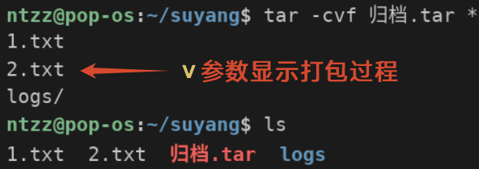
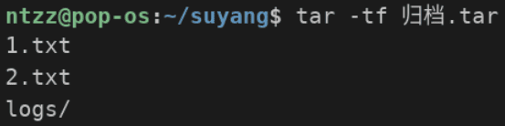
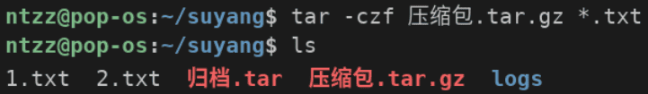
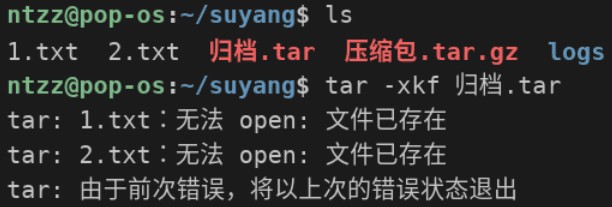
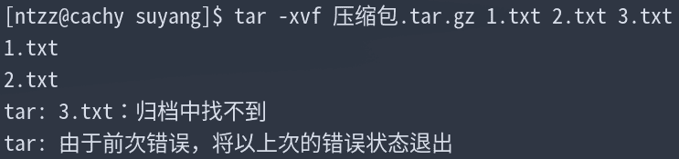

# <center>打包 - 压缩 - 解包</center>

## `tar`命令

### 语法

```bash
tar 参数 打包[压缩]后文件名 想要打包的目录/文件路径
```

### 常用参数

- 操作模式（**必须**）
  - `-c`：打包（**创建归档**）
  - `-x`：解包
  - `-t`：查看归档内容
- 辅助模式
  - `-f`：指定归档文件名，必须放在所有参数**最后**，**必需**
  - `-v`：显示打包过程
  - 压缩
    - `-z`：`gzip`格式，扩展名为`.gz`，最快，压缩率最低，最常用
    - `-j`：`bzip2`格式，扩展名为`.bz2`，平衡，使用率最低
    - `-J`：`xz`格式，扩展名为`.xz`，最慢，压缩率最高
  - `-p`：保留文件权限
  - `-k`：解包时如果遇到同名文件，则报错并退出

## `tar`示例

### 打包并显示打包过程

```bash
tar -cvf 归档.tar *  #仅打包，不压缩，因此参数中没有"z"，扩展名也没有".gz"等
```



### 查看归档内容

```bash
tar -tf 归档.tar
```



### 打包并压缩

```bash
tar -czf 压缩包.tar.gz *.txt  #"z"参数代表压缩，".gz"扩展名代表压缩格式
```



### 解包到当前路径

```bash
tar -xkf 归档.tar[.gz]  #文件名后没有路径即代表当前路径
```



### 解包到指定路径

```bash
tar -xvf 归档.tar[.gz] -C 目标路径  #"-C"参数必须为大写
```

![tar -xvf 归档.tar[.gz] -C 目标路径](./Images/tar-解包到指定路径.png)   

如图所示，目标路径必须已存在，不存在会报错

### 解包指定文件

```bash
tar -xvf 归档.tar[.gz] 文件名1 文件名2 ……  #指定的文件不存在会报错
```



### 使用通配符
```bash
tar -xvf 归档.tar[.gz] --wildcards 带通配符的文件名
```  

![tar -xvf 归档.tar[.gz] --wildcards 带通配符的文件名](./Images/tar-wildcards.png)
