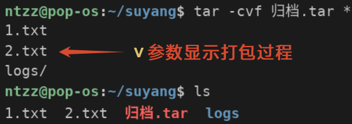
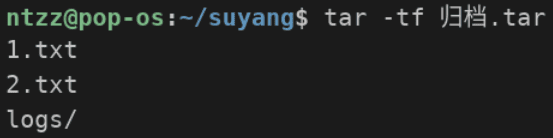
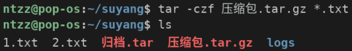
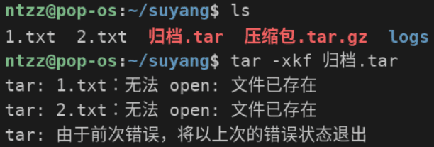

# <center>打包 - 压缩 - 解压</center>

## `tar`命令

### 语法
```bash
tar 参数 打包[压缩]后文件名 想要打包的目录/文件路径
```  
### 常用参数
- 操作模式（**必须**）
  - `-c`：打包（**创建归档**）
  - `-x`：解包
  - `-t`：查看归档内容
- 辅助模式
  - `-f`：指定归档文件名，必须放在所有参数**最后**，**必需**
  - `-v`：显示打包过程
  - 压缩
    - `-z`：`gzip`格式，扩展名为`.gz`，最快，压缩率最低，最常用
    - `-j`：`bzip2`格式，扩展名为`.bz2`，平衡，使用率最低
    - `-J`：`xz`格式，扩展名为`.xz`，最慢，压缩率最高
  - `-p`：保留文件权限
  - `-k`：解包时如果遇到同名文件，则报错并退出

### 示例
- 将当前目录下所有的目录和文件，打包为`归档.tar`文件，并显示打包过程
  ```bash
  tar -cvf 归档.tar *
  ```  
  

- 查看归档内容
  ```bash
  tar -tf 归档.tar
  ```  
  

- 将当前目录下所有`.txt`文件，打包并压缩为`压缩包.tar.gz`文件
  ```bash
  tar -czf 压缩包.tar.gz *.txt
  ```  
  

- 解包到当前路径
  ```bash
  tar -xkf 归档.tar
  ```  
  
