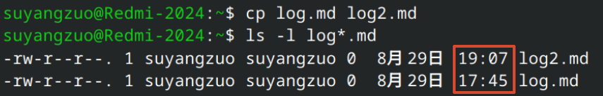

# 
文件处理

## 浏览

`ls`：列出 **当前目录**下的所有目录和文件

- 可选参数：
    - `-F`：用 **/** 表示目录
    - `-a`：列出 **隐藏**目录和文件
    - `-R`：递归显示
    - `-l`：长列表 **(详细信息)**
- 过滤器：
    - `?`：任意单字符
    - `*`：任意数量字符
    - `[...]`：字符集
    - `[!...]`：排除字符集

---  
`pwd`：显示当前目录的绝对路径

## 创建

`mkdir`：创建目录

- 可选参数：
    - `-p`：直接创建多级目录
    - `-m`：设置目录权限
    - `-v`：创建后显示确认信息

---  
`touch`：创建空文件

- 如文件已存在，则会将文件的修改时间更新为当前时间，但不会改变文件内容

## 复制和剪切

`cp`：复制文件或目录

- `cp 源文件名 新文件名`：源文件复制为新文件  
  
- `cp 源文件 目标目录`：将源文件递归复制到目标目录
- `cp -r 源目录 目标目录`
    - 目标目录 **已存在**：将源目录递归复制到目标目录
    - 目标目录 **不存在**：自动创建目标目录，将源目录下的所有文件和子目录复制到目标目录
- 可选参数：
    - `-r`：递归复制
    - `-v`：显示复制结果
    - `-i`：覆盖确认

---
`mv`：剪切文件或目录

- 基本用法和`cp`一致
- 剪切目录无需`-r`参数

## 删除

`rmdir`：删除空目录

---  

`rm`：删除文件或目录

- **不会放到回收站！！！**
- 可选参数：
    - `-r`：递归删除
    - `-f`：强制删除，忽略删除过程中的错误
    - `-i`：删除确认

## 重命名

`mv`：重命名文件

- `mv 原文件名 新文件名`：仅**移动**文件名，就是重命名