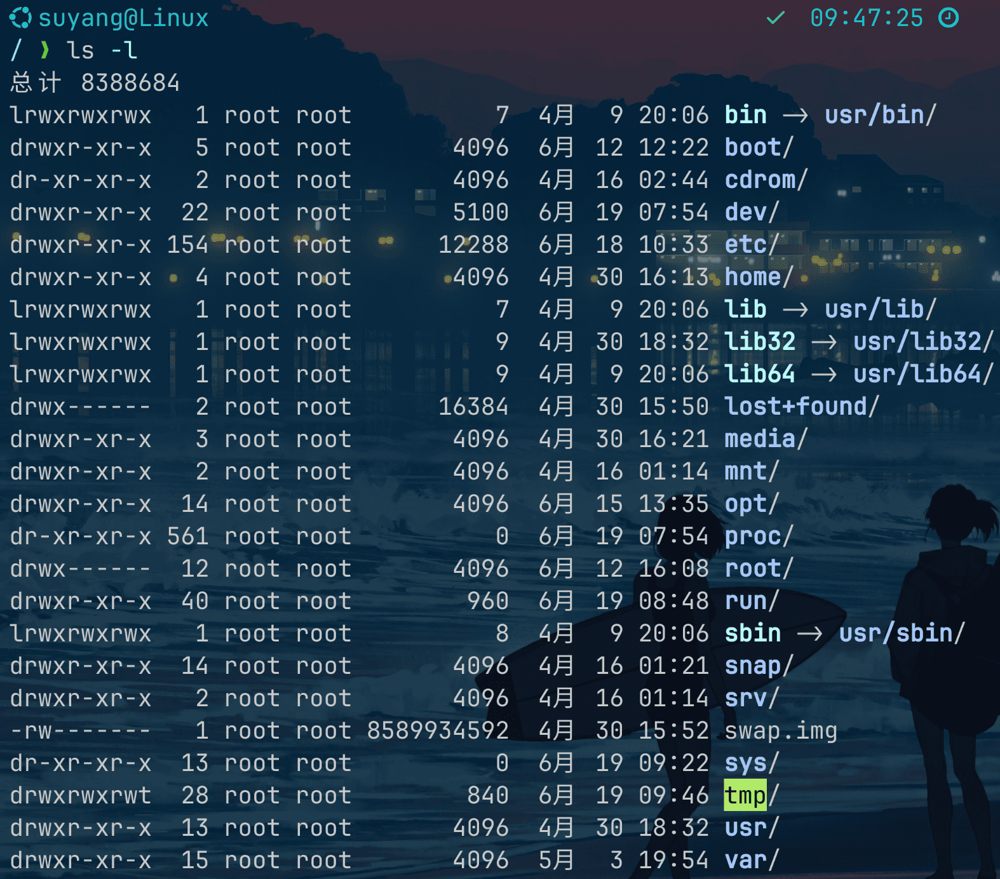
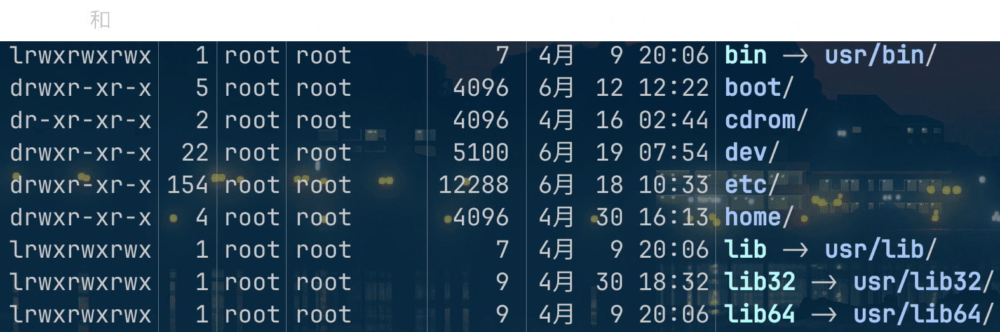
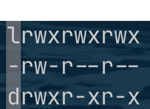
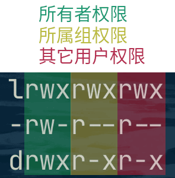
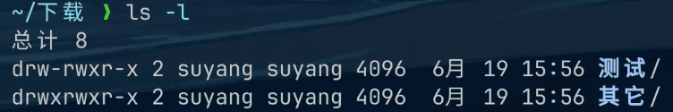
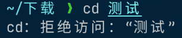

# <center>文件权限</center>

## 什么是文件权限

**文件权限**是**Linux安全模型**中的核心，为了保证系统的安全性，Linux系统对文件的访问权限进行了严格的控制。

Linux将用户分为**3**个基本组别，每个组别都有不同的文件权限级别。

- **所有者 `owner`**：文件的所有者权限
- **所属组 `group`**：文件的所属组权限
- **其他用户 `all users`**：其他用户权限

Linux中的每个文件都有**3**个基本权限：

- 读 `r` `read` ：读取、使用文件内容
- 写 `w` `write` ：修改文件内容
- 执行 `x` `execute` ：执行文件 **/** 访问目录

## 查看文件权限

查看文件权限的命令为：

  ```bash
  ls -l   # -l参数用于显示文件的详细信息，包括文件权限、文件大小、文件修改时间等信息
  ```

运行之后，会看到类似这样的输出结果：



我们逐一解释输出结果中的各个字段：



我们在这篇文章中只关注第1个字段：**文件类型和权限**。

## 文件类型

在 `ls -l` 的输出结果中，第1个字段就是文件类型：



[LinuxConfig.org](https://linuxconfig.org/identifying-file-types-in-linux) 网站的这篇文章对 Linux
文件类型有详细的阐述，本文章对其进行精简总结。

Linux 一共包含**7**种文件类型：

- `-` 普通文件
- `d` 目录
- `l` 符号链接
- `b` 块设备
- `c` 字符设备
- `s` 套接字
- `p` 命名管道

其中，`-`、`d`，是最常见的2种文件类型。

## 文件权限

后面9个字段，被分成了3组，每组3个字符，分别表示文件的所有者、所属组、其他用户的权限。



以上图第3行 `drwxr-xr-x` 为例：

- 文件类型：`d` **目录**
- 用户与权限对照表

|        | 所有者权限 | 所属组权限 | 其它用户权限 |
  |-------:|:-----:|:-----:|:------:|
|  读 `r` |   ✅   |   ✅   |   ✅    |
|  写 `w` |   ✅   |   ❌   |   ❌    |
| 执行 `x` |   ✅   |   ✅   |   ✅    |

想了解更多有关文件权限的知识，请参考：

- [Linux file permissions explained](https://www.redhat.com/en/blog/linux-file-permissions-explained)
- [Classic SysAdmin: Understanding Linux File Permissions](https://www.linuxfoundation.org/blog/blog/classic-sysadmin-understanding-linux-file-permissions)

## 修改文件权限

在 Linux 中，我们通过 `chmod`（**change mode**）命令来修改权限，其语法为：

```bash
chmod [ugoa][+-=][rwx] 文件或目录    # chmod [用户][操作][权限] [文件或目录]
```

- 用户
    - `u` 所有者
    - `g` 所属组
    - `o` 其它用户
    - `a` 所有用户，即 `ugo`
- 操作
    - `+` 添加权限
    - `-` 移除权限
    - `=` 设置权限
- 权限
    - `r` 读
    - `w` 写
    - `x` 执行

比如，新建文件夹：`测试`，可以打开这个文件夹，因为我是这个文件夹的**所有者**，权限中包含了`x`，即：
**执行**。


上图显示，**测试**目录的所有者权限为：`rwx`，其中包含了 `x` 权限，因此可以正常打开此目录。

现在，让我们**移除文件所有者的执行权限**
，看看会发生什么：

```bash
chmod u-x 测试   # u-x 表示移除文件所有者的执行权限
```


运行 `ls -l`，看看权限的变化：



可以看到，**测试**目录的所有者权限 `rw-` 中，已经没有 `x` 权限了。再次尝试在终端中访问**测试**目录：

