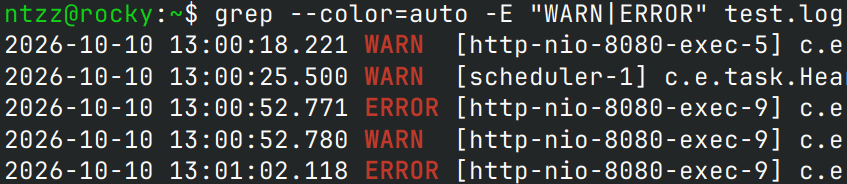

# <center>文本处理三剑客</center>

## `学前寄语`

文本处理领域，**正则表达式**是必过的坎。如果不会正则表达式，则文本处理工作会受到很大的限制。有关**正则表达式**的使用，可访问[知识库：正则表达式](/Markdown-Notes/?技术栈=通用&笔记=正则表达式)，或是[第三方在线教程](/Tutorials/编程开发/regular-expression.html)。

## `grep`

### 简介

`grep`即`global regular expression print`，用于在文本中以指定的模式（**正则表达式**）进行搜索。

- 基本语法
  ```bash
  grep [选项] 模式 [文件]  #"grep"默认输出整行
  ```

### 选项

- 匹配控制

  | 选项 | <center>说明</center>              |
  | :--: | ---------------------------------- |
  | `-i` | 忽略大小写                         |
  | `-v` | 反向匹配（显示不匹配的行）         |
  | `-w` | 匹配整个单词                       |
  | `-x` | 匹配整行                           |
  | `-F` | 将模式视为固定字符串（不解释正则） |
  | `-E` | 使用扩展正则表达式（等价于`egrep`  |
  | `-G` | 使用基本正则表达式（**默认**）     |
  | `-P` | 使用 Perl 正则表达式               |

- 输出控制

  |   选项    | <center>说明</center>                                                                                                                             |
  | :-------: | ------------------------------------------------------------------------------------------------------------------------------------------------- |
  |   `-c`    | 只输出匹配的行数                                                                                                                                  |
  |   `-l`    | 只输出包含匹配的文件名                                                                                                                            |
  |   `-L`    | 只输出不包含匹配的文件名                                                                                                                          |
  |   `-o`    | 只输出匹配的部分                                                                                                                                  |
  |   `-q`    | 静默模式，不输出任何内容                                                                                                                          |
  |   `-s`    | 不显示错误信息                                                                                                                                    |
  |   `-h`    | 多文件时不显示文件名                                                                                                                              |
  |   `-H`    | 显示文件名                                                                                                                                        |
  |   `-n`    | 显示行号                                                                                                                                          |
  |   `-b`    | 显示字节偏移量                                                                                                                                    |
  | `--color` | `--color`（相当于`--color=auto`）<br> `--color=auto`（输出到终端时高亮，**默认**）<br>`--color=always`（始终高亮）<br>`--color=never`（从不高亮） |

- 上下文控制

  |  选项  | <center>说明</center>       |
  | :----: | --------------------------- |
  | `-A n` | 显示匹配行及其**后n行**     |
  | `-B n` | 显示匹配行及其**前n行**     |
  | `-C n` | 显示匹配行及其**前后各n行** |

- 目录与文件

  |        选项         | <center>说明</center>        |
  | :-----------------: | ---------------------------- |
  |        `-r`         | 递归搜索目录                 |
  |        `-R`         | 递归搜索目录（跟随符号链接） |
  |  `--include=GLOB`   | 只搜索匹配的文件             |
  |  `--exclude=GLOB`   | 排除匹配的文件               |
  | `--exclude-dir=DIR` | 排除目录                     |
  |        `-a`         | 将二进制文件当作文本处理     |
  |        `-I`         | 忽略二进制文件               |

- 其它

  |   选项    | <center>说明</center>         |
  | :-------: | ----------------------------- |
  |  `-m n`   | 每个文件最多匹配**n**次后停止 |
  | `-e 模式` | 指定多个模式                  |
  | `-f 文件` | 从文件读取模式                |
  |   `-z`    | 用`NUL`分隔行                 |

### 范例

- 输出所有包含`WARN`和`ERROR`的行，高亮其中的`WARN`和`ERROR`

  ```bash
  grep --color=auto -E 'WARN|ERROR' 文件名
  ```

  

## `sed`

## `awk`
