# <center>查找文件</center>

## `find`语法

### 基础语法

```bash
find [查找路径] [查找模式] [文件名称] [动作]  #这里的"文件"泛指"目录"和"普通文件"
```

### 按**路径**查找

```bash
find 路径1 路径2 路径3 ……  #最基础、最简单的用法，会递归输出这些路径下的所有目录和文件
```

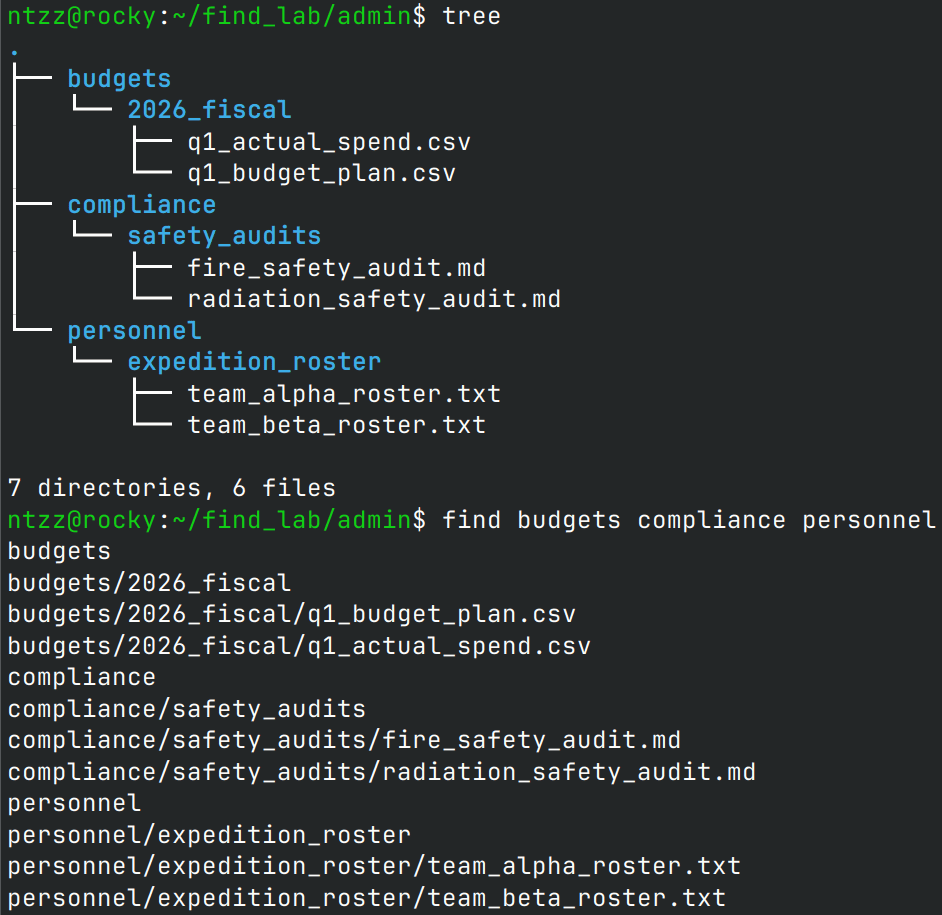  
如图所示，这种用法还不如直接用`tree`来得简洁方便，现实中几乎不会这么使用`find`。

### 按**名称**查找

```bash
find [查找路径] -[name/iname] ["文件名称"]  #递归搜索路径下匹配的文件名称
```

- `-[name/iname]`通配符

  |      通配符      | 含义                         |
  | :--------------: | ---------------------------- |
  |       `*`        | 匹配任意个字符               |
  |       `?`        | 匹配单个字符                 |
  | `[abc]`或`[123]` | 匹配`[]`中的任意一个字符     |
  | `[a-z]`或`[0-9]` | 匹配`[范围]`内的任意一个字符 |
  |      `[!a]`      | 匹配除`a`外的任意单个字符    |

- 没有通配符，则文件名采用**严格匹配模式**

  ```bash
  find . -name "2026"  #文件名必须叫"2026"，不能多也不能少
  ```

  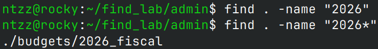

  如图所示，用`2026`无法匹配`2026_fiscal`；必须使用通配符，如`2026*`，表示`2026`后面可以有任意个字符。

  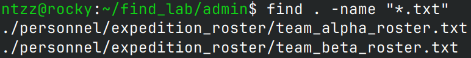

- 忽略大小写

  ```bash
  #find [查找路径] -iname ["文件名称"]
  find . -iname "*.txt"  #"-iname"会忽略大小写
  ```

  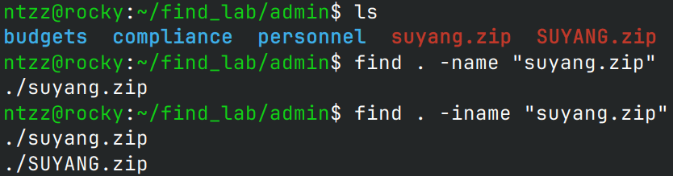

- 多个文件名匹配
  - **无**动作

    ```bash
    #"-or"代表"或"，也可以写成"-o"
    find . -name "文件名1" -or -name "文件名2" -or -name "文件名3" ……
    ```

    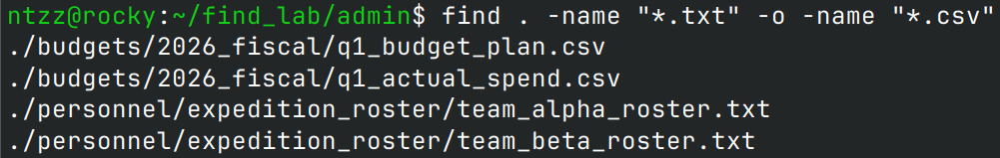

  - **有**动作
    ```bash
    #不能直接打"()"，必须用"\"进行转义，且"()"内必须加空格
    find . -name \( "文件名1" -or -name "文件名2" -or -name "文件名3" …… \) 动作
    ```
    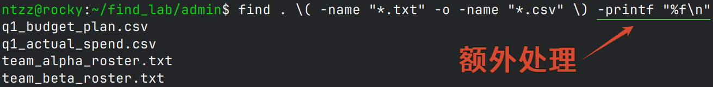

### 按**类型**查找

```bash
find 路径 -type 类型
```

| 类型 | 说明                 |
| :--: | -------------------- |
| `f`  | 普通文件             |
| `d`  | 目录                 |
| `l`  | 符号链接             |
| `b`  | 块设备文件           |
| `c`  | 字符设备文件         |
| `p`  | 命名管道（FIFO）     |
| `s`  | 套接字文件（socket） |

- 搜索目录

  ```bash
  find . -type d
  ```

  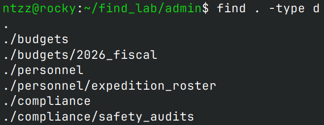

- 搜索普通文件
  ```bash
  find . -type f
  ```
  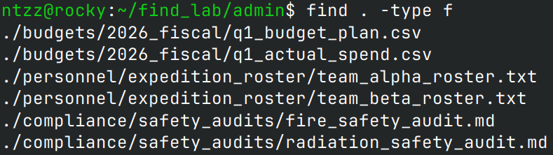

### 按**文件大小**查找

**注意**：这里说的`文件`，是指**普通文件**，不包括目录、符号链接等。

```bash
#find [查找路径] -size [符号][数字][单位]
find 查找路径 -size [+-][n][ckMG]
```

- 单位
  - `c`：字节
  - `k`：KB
  - `M`：MB
  - `G`：GB
- 符号
  - `+n`：大于n
  - `-n`：小于n
  - `n`：等于n

```bash
find . -size +3k -exec eza -l --header {} +  #从"-exec"开始为动作
```

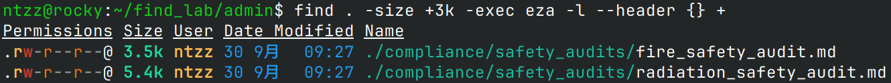

如上图，查找出来的文件大小均`>3k`。

### 按**时间**查找

- 文件的时间属性

  | 时间     | 英文                            | 描述                                                       |
  | -------- | ------------------------------- | ---------------------------------------------------------- |
  | 访问时间 | `atime` **(** Access time **)** | 最后一次读取（访问）文件内容的时间                         |
  | 修改时间 | `mtime` **(** Modify time **)** | 最后一次修改文件内容的时间                                 |
  | 变更时间 | `ctime` **(** Change time **)** | 最后一次改变文件元数据（如权限、所有者）、修改时间、重命名 |

  可以使用`stat 文件名`的方式，查看这些时间属性：
  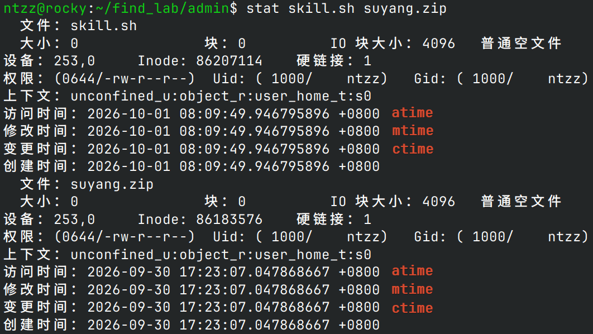

  除了`[amc]time`可以表示天数外，还可以用`[amc]min`表示**分钟**。

- 时间值符号
  - `+n`：**n**天/分钟**之前**
  - `-n`：**n**天/分钟**之内**
  - `n`：
    - **小时**：前`n×24`小时 - 前`(n+1)×24`小时**之间**
    - **分钟**：前`n`分钟 - 前`n+1`分钟**之间**

- 示例
  - 递归查找当前路径下**30分钟内**修改过的普通文件

    ```bash
    #递归查找当前路径下30分钟内修改过的普通文件
    find . -type f -mmin -30
    ```

    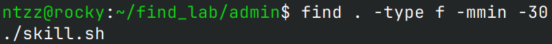

  - 递归查找当前路径下**1天内**变更过元数据的普通文件
    ```bash
    #递归查找当前路径下1天内变更过元数据的普通文件
    find . -type f -ctime -1
    ```
    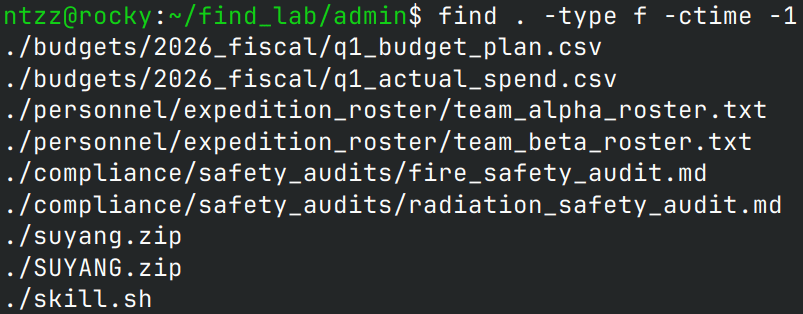

### 按**权限**查找

```bash
#数字模式权限
find 查找路径 -perm 3位数字权限  #"perm"是"Permissions"的缩写，意为"权限"

#字母模式权限
find 查找路径 -perm [/-][ugoa][=][rwx]  #此处"ugoa"只能写1个，不能组合
```

- 用**数字模式**查找

  ```bash
  #在当前路径中递归查找：权限为644，并且大于5k的目录或文件
  find . -perm 644 -size +5k
  ```

  如图所示，找到的文件权限均为`644`，且`>5k`。

  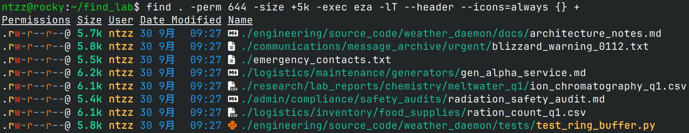

- 用**字母模式**查找
  - 无前缀：精确匹配

    ```bash
    #精确匹配模式下，未写出的权限代表不存在，而不是任意
    find 路径 -perm [ugoa]=[rwx]
    ```

    比如`find . -perm u=rw`，只能匹配权限为`600`的目录或文件：
    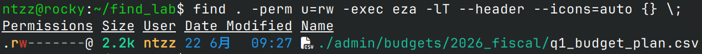

  - `/`前缀：任意匹配

    ```bash
    #任意匹配模式下，实际权限只需要"至少有一个"即可匹配
    find 路径 -perm /[ugoa]=[rwx]
    ```

    比如`find . -perm /g=rw`，所属组权限在`rw`中具备其一即可匹配。  
    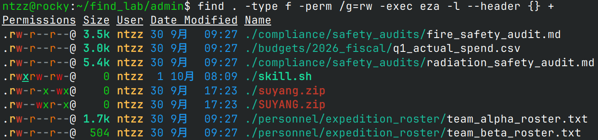  
    如上图所示，所属组权限只要在`r`和`w`中任意具备一个就会匹配：然而，只有`skill.sh`这个文件是`rw`二者兼备的。

  - `-`前缀：包含匹配
    ```bash
    #包含匹配模式下，实际权限必须完全包含缩写权限方能匹配
    find 路径 -perm -[ugoa]=[rwx]
    ```
    比如`find . -perm -g=rw`，所属组权限必须包含`rw`方可匹配，也就是至少为`6`。  
    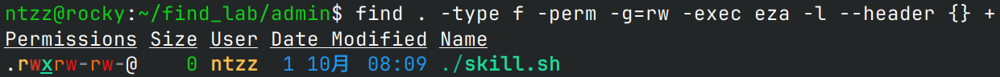  
    如上图所示，所属组权限包含`rw`二者的只有`skill.sh`：

### 按**所有者`/`所属组**查找

- 按**所有者**查找

  ```bash
  find 查找路径 -user 用户名
  ```

  递归查找当前路径下**所有者为ntzz**的目录或文件：  
  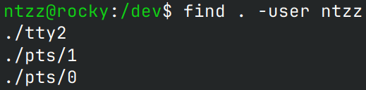

- 按**所属组**查找
  ```bash
  find 查找路径 -group 组名
  ```
  递归查找当前路径下**所属组为cdrom**的目录或文件：  
  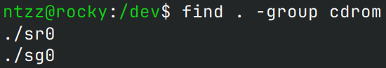

### 限制递归深度

- `-maxdepth n`：限制最大递归深度为`n`
- `-mindepth n`：限制最小递归深度为`n`

**注意**：多个搜索条件并列时，建议将限制递归深度写在**最前面**。

- 在主目录中，以递归深度`2-4`查找大小`>1MB`的普通文件
  ```bash
  find ~ -mindepth 2 -maxdepth 4 -size +1M -type f
  ```
  如图所示，找到的文件大小均`>1MB`：
  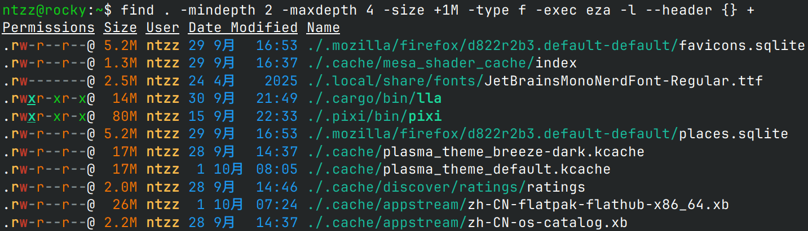

### 组合条件

- `-and`：**并且**，优先级：**中**，可缩写为`-a`，是多个条件之间的默认值，不写（只留空格）即为`-and`
- `-or`：**或者**，优先级：**低**，可缩写为`-o`
- `-not`：**非**，优先级：**高**，可缩写为`!`，但实际使用时，需要转义：`\!`
- 示例
  - 在当前路径下，以最大递归深度`4`查找`>10MB`且权限**不是**`644`的目录或文件

    ```bash
    find . -maxdepth 4 -size +10M \! -perm 644
    ```

    如图所示，找到的文件大小均`>10MB`，权限**不是**`644`：
    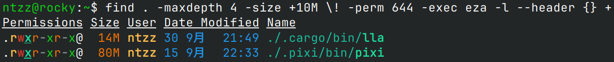

  - 在当前路径下，查找`>4k`，扩展名为`.md`**或**`.log`的文件
    ```bash
    #"-size"和后面的"-name"默认为"-and"关系，优先级高于"-or"，因此两个"-name"需要先用"()"包裹起来
    find . -size +4k \( -name "*.md" -or -name "*.log" \)
    ```
    如图所示，找到的文件大小均`>4k`，扩展名是`.md`或`.log`：
    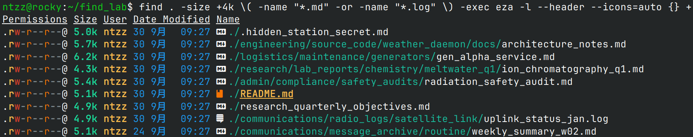

## 动作

### 格式化输出

```bash
#"-printf"是默认动作，也就是说如果不写"-printf"，也没有执行外部命令，就会用"-printf"输出
find 查找路径 查找模式 文件名称 -printf "格式化占位符"
```

| 占位符 | 说明                                     |
| :----: | ---------------------------------------- |
|  `%p`  | 文件名（**含路径**）                     |
|  `%f`  | 文件名（**不含路径**）                   |
|  `%h`  | 所在目录的路径                           |
|  `%d`  | 在目录树中的深度（`0`表示查找路径本身）  |
|  `%s`  | 文件大小（**字节**）                     |
|  `%m`  | 文件权限（**八进制数字**）               |
|  `%M`  | 文件权限（**字母形式，如`-rw-r--r--`**） |
|  `%u`  | 所有者（**用户名**）                     |
|  `%g`  | 所属组（**组名**）                       |
|  `%U`  | 所有者（**数字UID**）                    |
|  `%G`  | 所属组（**数字GID**）                    |
|  `%i`  | 文件的inode号                            |
|  `%n`  | 硬链接数                                 |
|  `%l`  | 符号链接指向的目标（非链接文件为空）     |
|  `%y`  | 文件类型（`f`/`d`/`l`等）                |
|  `%t`  | 修改时间                                 |
|  `%a`  | 访问时间                                 |
|  `%c`  | 变更时间                                 |
|  `%%`  | 字面量`%`                                |
|  `\n`  | 换行                                     |
|  `\t`  | 制表符                                   |

```bash
#查找所有的Markdown文档，输出这些文档的"类型、大小、数字权限、文件名"
#文件大小不一，"%-5s"中的"5"表示占用固定5个字符宽度，"-"表示左对齐
find . -name ".md" -printf "%y %-5s %m %f\n"
```

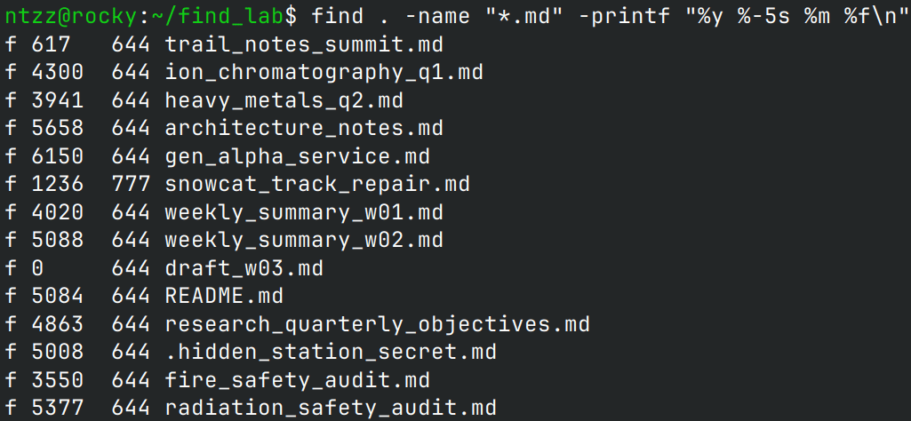

### 找到`1`个就退出

```bash
#注意：用了"-quit"就不会输出，如果想输出，必须写在"-quit"前面
find 查找路径 查找模式 文件名称 -quit
```

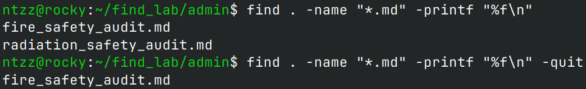

如上图所示，用了`-quit`后，找到第`1`个文件就不会再找了。为了能够输出文件，`-printf`必须写在`-quit`前面。

### 直接删除

```bash
#不经提示就直接删除，慎用！！！！！
find 查找路径 查找模式 文件名称 -delete
```

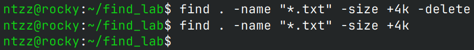

如上图所示，使用`-delete`会不经提示直接删除匹配的文件，删除之后再找已经找不到了。

### 跳过指定目录

```bash
#跳过单个目录
find 查找路径 -path 跳过目录 -prune -or 查找模式 文件名称 动作

#跳过多个目录
find 查找路径 \( -path 跳过目录1 -o -path 跳过目录2 …… \) -prune -or 查找模式 文件名称 动作
```

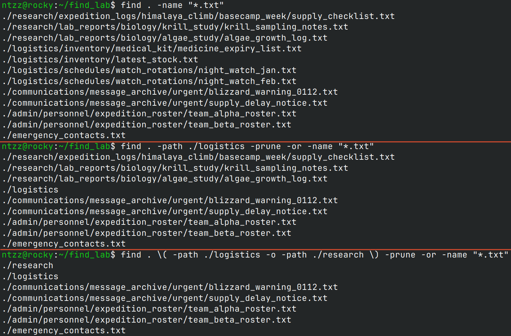

如上图所示，使用`-prune`可以跳过指定目录，这些目录中的文件不会被递归查找。

### 执行外部命令

- 在**当前路径**执行外部命令
  **当前路径**指的是运行`find`命令的路径。

  ```bash
  #"{}"是占位符，每找到一个文件，"{}"就会被替换成此文件的带路径名称
  #"\;"表示每个文件单独执行命令；"+"表示所有文件合并执行命令
  find 查找路径 查找模式 文件名称 -exec 外部命令 {} [\;或+]
  ```

  ![find 查找路径 查找模式 文件名称 -exec 外部命令 {} [;或+]](./Images/find-exec-单次-合并.png)

  如上图所示，使用`\;`表示每个文件单独执行命令；用`+`则会合并执行。通常情况下，用`+`效率更高，可读性更好。

- 在**文件所在路径**执行外部命令

  ```bash
  find 查找路径 查找模式 文件名称 -execdir 外部命令 {} [\;或+]
  ```

  ![find 查找路径 查找模式 文件名称 -execdir 外部命令 {} [;或+]](./Images/find-execdir.png)

  如上图所示，每个文件显示的路径都是自己所在目录的相对路径：`./`。因为文件的绝对路径各不相同，因此即使用了`+`，也只有绝对路径相同的文件会被合并执行。

- **交互式**执行外部命令
  ```bash
  #"-ok"必须和"\;"配套使用
  find 查找路径 查找模式 文件名称 -ok 外部命令 {} \;
  ```
  **交互式**意味着每次执行命令都需要用户确认，因此无法合并执行，只能一个一个执行，故`-ok`只能配合`\;`使用。
  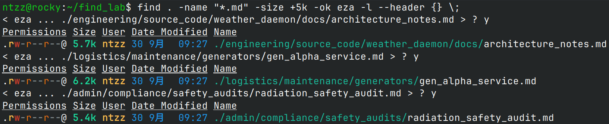

  如上图所示，每次执行命令，用户都要输入`y`确认，如果直接回车或者输入别的字符，则不会执行该命令。
