# <center>用户和组</center>

## 查看用户和组

### 查看所有用户

```bash
cat /etc/passwd  #查看系统所有用户
```

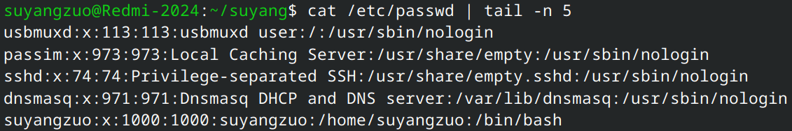

输出的信息似乎有些杂乱无章，我们以最后一行为例，看看每一段信息的含义：  
`suyangzuo:x:1000:1000:suyangzuo:/home/suyangzuo:/bin/bash`

| 用户名    | 密码占位符 | 用户ID | 组ID | 用户描述  | 主目录          | 登录 Shell |
| --------- | :--------: | ------ | ---- | --------- | --------------- | ---------- |
| suyangzuo |     x      | 1000   | 1000 | suyangzuo | /home/suyangzuo | /bin/bash  |

### 查看所有组

```bash
cat /etc/group  #查看系统所有组
```

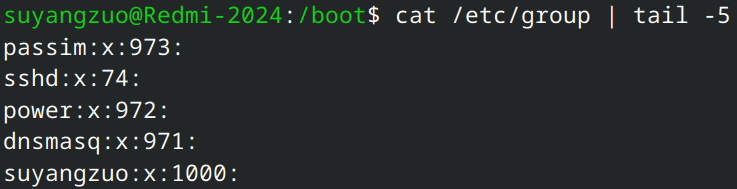

居然有一个和用户同名的组！不要奇怪，这是现代`Linux`发行版的通用操作：创建一个用户时，系统通常会同时创建一个和用户名同名的组，并将其设置为该用户的主组`primary group`。

同样，我们以最后一行为例，看看每一段信息的含义：  
`suyangzuo:x:1000:`

| 组名      | 组密码占位符 | 组ID | 附加成员 |
| --------- | :----------: | ---- | :------: |
| suyangzuo |      x       | 1000 |    无    |

### 查看用户属于哪些组

```bash
id 用户名  #查看用户suyangzuo属于哪些组
```

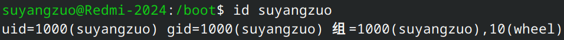

`uid=1000(suyangzuo) gid=1000(suyangzuo) 组=1000(suyangzuo),10(wheel)`，含义如下：

| `uid`：用户ID(用户名) | `gid`：主组ID(组名) | `组`：所属组列表          |
| --------------------- | ------------------- | ------------------------- |
| 1000(suyangzuo)       | 1000(suyangzuo)     | 1000(suyangzuo),10(wheel) |

- `wheel`是什么组？
  - 在现代**红帽派系**发行版中，`wheel`是一个特殊的管理组，只要用户属于`wheel`组，就能通过`sudo`执行管理员命令。
- **Debian派系**可能会输出其它结果
  - `Debian`派系可能会输出其它结果，例如`sudo`组，同样用于授予用户使用`sudo`权限。

### 查看文件的所有者和所属组

在`Linux`系统中，所有的**目录**和**文件**都有**所有者**和**所属组**。所有者一般就是创建文件的用户，所属组一般就是该用户的主组。
`ls -l`命令可以非常方便地查看这些信息。

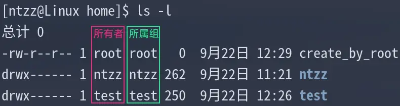

其中，`create_by_root`文件是用`sudo`命令创建的，因此其所有者为`root`账户。

## 管理用户和组

### 创建新用户

```bash
sudo useradd 用户名  #一般需要root账户才能创建新用户
```

- `useradd`常用参数
  - `-m`：创建主目录
  - `-s shell路径`：指定登录shell

- 范例
  ```bash
  sudo useradd -m -s /bin/bash suyang  #推荐在创建新用户时创建主目录并指定shell
  ```

### 切换用户

```bash
su 用户名  # su = switch user（切换用户）
```

**特别注意**：这里的切换用户，是指**终端环境**的切换，而不是**桌面环境**的切换。

- `su`常用参数
  - `-`：切换登录环境（**推荐**）

  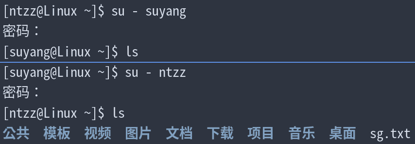  
  从图中可以看出，切换到`suyang`用户后，主目录是空的，因为创建`suyang`用户时，只创建了主目录：`/home/suyang`，而没有创建里面的子目录，比如**公共**、**模板**等。有的桌面环境在第一次登录时会自动创建这些子目录。

### 修改用户

- 何时需要修改用户？
  - 修改密码
  - 修改用户名
  - 修改登录shell
  - 修改主组

- 修改密码
  - `sudo passwd 用户名`  
    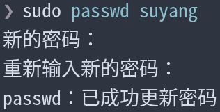

- 修改用户名
  - `sudo usermod -l 新用户名 旧用户名`
    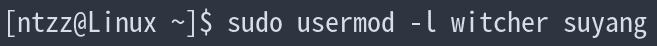
  - **注意**：修改用户名后，原用户的主目录不会自动更改，最好手动修改。  
    `sudo usermod -d 新主目录路径 -m 新用户名`
    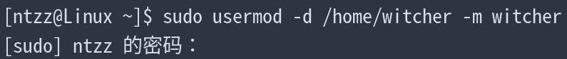

    使用`ls`命令查看主目录是否已经更换为新用户的名称：
    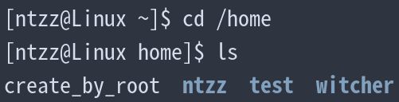

  - 修改用户名与修改主目录一步完成  
    `sudo usermod -l 新用户名 -d /home/新用户名 -m 旧用户名`
  - **特别注意**：如果采用**一步完成**，则`-m`最后要用**旧用户名**；如果是**两步完成**，则要用**新用户名**  
    **原理**：`-m`参数后面永远使用**当前实际存在的用户名**，一步完成时，用户名尚未更改，因此使用旧名。

    ```bash
    #一步完成
    sudo usermod -l 新用户名 -d /home/新用户名 -m 旧用户名  #"-m"后面用"旧用户名"

    #两步完成
    sudo usermod -l 新用户名 旧用户名
    sudo usermod -d /home/新用户名 -m 新用户名  #"-m"后面用"新用户名"
    ```
- 修改登录shell
  - `sudo usermod -s shell路径`  
    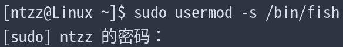  
    修改后，用户再次打开终端，会默认使用`fish`。

- 修改主组
  - 有的时候，管理员需要删除某个组，但如果这个组里还有用户（且将该组作为主组），则无法删除该组。因此，必须先将这些用户分配到别的主组。  
    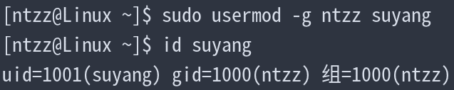  
    可以看出，修改后，`suyang`用户的主组（`gid`）变成了`ntzz`。

### 删除用户

```bash
sudo userdel 用户名  #删除用户
```

**特别注意**：删除用户时，同名组是否被自动删除，取决于有没有其它用户将其作为主组。

- 删除前检查用户是否被进程占用：

  ```bash
  ps -u 用户名  #查看该用户是否被进程占用
  ```

  下图中，`ps -u 用户名`返回的字段都有值，说明该用户正被这些进程占用。最好先终止这些进程，再删除用户。  
  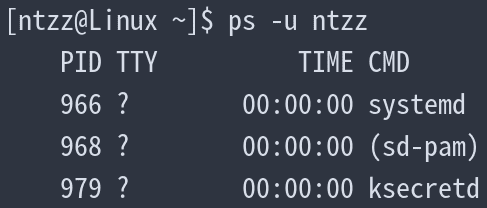

  下图中，`ps -u 用户名`返回的字段没有值，说明该用户未被占用，可放心删除。  
  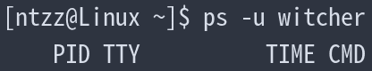

- `userdel`常用参数
  - `-r`：删除主目录、邮件（**推荐**）
    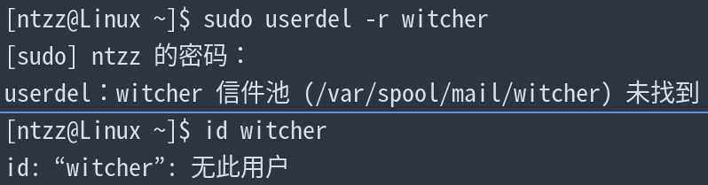
  - `-f`：强制删除，即使用户被占用（**不推荐**）

### 删除组

```bash
sudo groupdel 组名  #删除组
```

- `groupdel`范例：  
  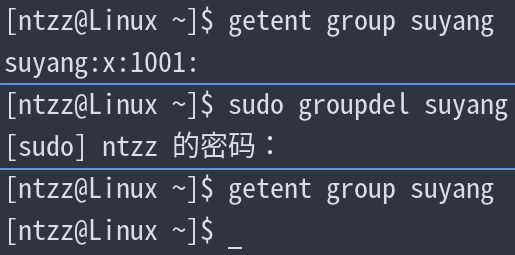  
  可以看出，删除组后，用`getent group 组名`命令已经找不到组信息了。