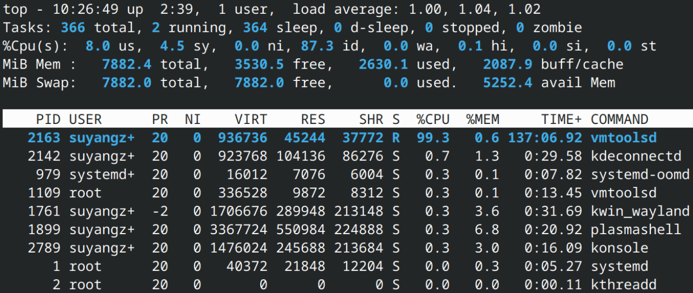
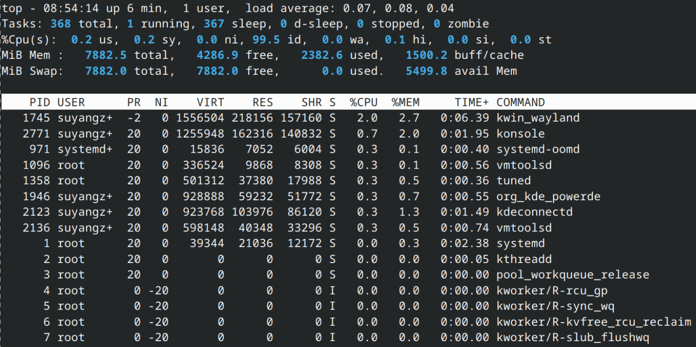
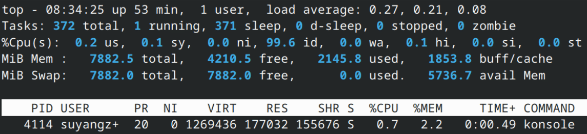

# 
系统监测命令

## top

### 默认用法

`top`命令显示系统摘要信息以及当前由Linux管理的进程或线程列表，和`ps`的**快照**形式不同，`top`命令是**实时**的，默认每隔`3`秒刷新一次。

### 摘要

- `Tasks`

  | 字段 | 含义 | 状态字段 |
  |------:|------|:----------:|
  | `total` | 当前系统中的**进程/线程**总数。 |   |
  | `running` | 正在运行或位于运行队列的进程 | `R` |
  | `sleep` | 处于**睡眠/休眠**状态的进程 | `S` |
  | `d-sleep` | 处于**不可中断睡眠**状态的进程 | `D` |
  | `stopped` | 被**暂停/停止**的进程 | `T` |
  | `zombie` | 僵尸线程数 | `Z` |

- `%Cpu(s)`

  | 字段 | 含义 |
  |:------:|------|
  | `us` | 用户空间进程的`CPU`占用率 |
  | `sy` | 内核空间进程的`CPU`占用率 |
  | `ni` | **低优先级**用户进程的`CPU`占用率 |
  | `id` | 空闲的`CPU`百分比 |
  | `wa` | `CPU`等待**I/O**操作的百分比 |
  | `hi` | 处理硬件中断消耗的`CPU`占用率 |
  | `si` | 处理软件中断消耗`CPU`占用率 |
  | `st` | 虚拟化环境中，当前虚拟机被宿主机`Hypervisor`强制抢占，从而**偷走**的`CPU`百分比 |

- `MiB Mem`

  | 字段 | 含义 |
  |------:|------|
  | `total` | 物理内存总容量 |
  | `free` | 空闲、可随时分配的内存容量 |
  | `used` | 已被使用的内存容量 |
  | `buff/cache` | 用于缓存的空闲内存容量 |

- `MiB Swap`

  | 字段 | 含义 |
  |------:|------|
  | `total` | 交换空间总容量 |
  | `free` | 空闲的交换空间容量 |
  | `used` | 已使用的交换空间容量 |
  | `avail Mem` | 物理内存可立即分配的容量 |

### 进程/线程列表

- 字段说明
  - `PID`：

### 常用参数

- `-d`：指定刷新频率，单位为**秒**

  

- `-n 数字`：指定刷新次数

### 常用快捷键

- `1`：切换`CPU`占用率的**综合显示模式**和**分离显示模式**
- `m`：切换`内存`占用率的显示模式
- `u`：按**用户名**筛选进程
- `o`：其它进程过滤器
  - 输入`S=R`：筛选所有正在运行的进程。
  - 输入`COMMAND=关键字`：按名称关键字筛选进程。
  
- `=`：清除进程列表所有过滤器
- `f`：字段管理界面
  - `s`：确认排序字段
  - `d`：添加/删除字段
  - `q`：返回信息界面
- `k`：按**PID**结束进程
  
  - `Send pid xxx signal [15/sigterm]:`
    - `15`：默认值，相当于直接回车，正常结束
    - `9`：强制结束
    - `2`：类似`Ctrl+C`  
- `进程排序`:
  - `N`：按**PID**降序
  - `M`：按`%MEM`降序
  - `P`：按`%CPU`降序
  - `R`：反转当前排序
