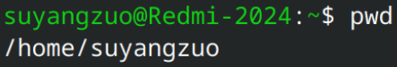
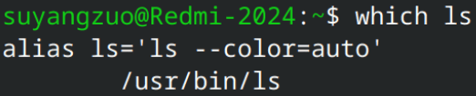
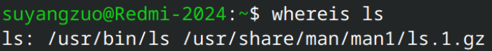

# 
路径命令

## 获取当前目录的绝对路径

`pwd`：获取当前目录的绝对路径  

## 获取可执行文件的绝对路径

`which`：在`$PATH`环境变量中搜索可执行文件，并返回其绝对路径  
  
如图，使用`which`命令，查到了`ls`文件的绝对路径为`/usr/bin/ls`。

---

`whereis`：在**预定义系统目录**中搜索**可执行文件**、**man页**、**源代码**，并返回其绝对路径  
  
如图，`whereis`不仅返回了`ls`可执行文件的绝对路径，还返回了其**man页**的绝对路径。  
- 可用参数
  - `-b`：仅返回**可执行文件**的绝对路径
  - `-m`：仅返回**man页**的绝对路径
  - `-s`：仅返回**源代码**的绝对路径  

## 切换目录

`cd 目录`：切换到指定目录

---

常用目录  

| 目录 | 说明 |
|------|------|
| `/`  | 根目录 |
| `~`  | 用户主目录，相当于 `/home/用户名` |
| `.`  | 当前目录 |
| `..` | 上一级目录 |