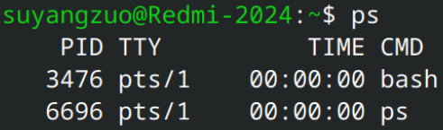
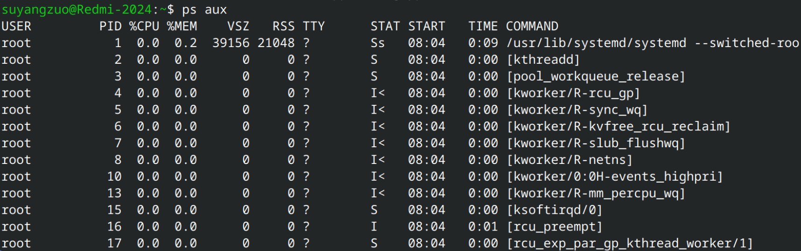
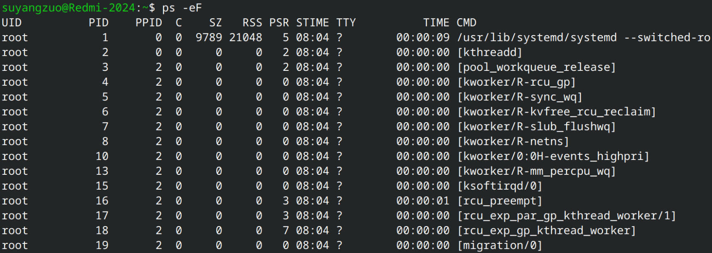
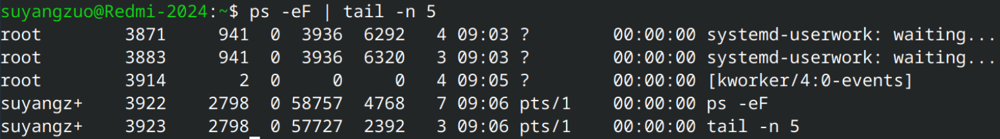
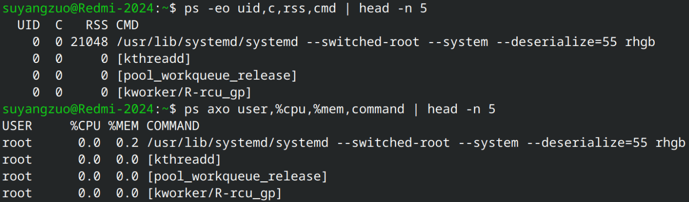

# 
进程监测命令

## ps

### 默认用法

`ps`命令默认只显示**当前终端当前用户的进程：**  
  
如图，当前终端运行着`bash`，以及`ps`本身；但是一个操作系统不可能只运行着这两个进程，对吧？怎么看到其他进程呢？我们需要使用各种参数来实现。

### 参数

- **BSD**风格  
  | 参数 | 含义 |
  | --- | --- |
  | **`a`** | 显示**所有终端**上的进程，包括其他用户的进程 |
  | **`u`** | 以**用户可读格式**输出（显示用户名、CPU%、MEM%、RSS、VSZ、STAT 等字段）|
  | **`x`** | 显示**没有控制终端**的进程（如守护进程、后台服务） |
  | **`l`** | **长格式**输出，显示更多字段 |
  | **`f`** | 以**树状结构**（ASCII art）显示进程父子关系 |
  | **`j`** | **作业控制格式**输出（显示 PGID、SID、TPGID 等） |
  | **`s`** | **信号格式**输出（显示待处理信号、被阻塞信号等） |
  | **`v`** | **虚拟内存格式**输出（显示 MINFLT、MAJFLT、VSZ、RSS、%MEM 等） |
  | **`m`** | 显示**线程**信息（在进程后列出其线程） |

- **Unix**风格  
  | 参数 | 含义 |
  | --- | --- |
  | **`-e`** | 显示**所有进程**（等同于 `-A`） |
  | **`-f`** | **完整格式**输出（增加 UID、PPID、C、STIME 等字段） |
  | **`-F`** | **额外完整格式**，在 `-f` 基础上增加 SZ、RSS、PSR 字段 |
  | **`-l`** | **长格式**输出 |
  | **`-u`** | 按**用户**过滤，并以用户可读格式显示（如 `-u root`） |
  | **`-a`** | 显示**所有终端**上的进程（不包括会话首领） |
  | **`-d`** | 显示所有进程，**排除会话首领** |
  | **`-x`** | 与 BSD 兼容，通常配合 `-a` 使用 |

### 常用用法

- `ps aux`：**BSD**风格，输出所有进程和详情  
  

- `ps -eF`：**Unix**风格，输出所有进程和详情  
  

- `ps | head/tail -n N`的结果只取**前N行**或**后N行**  
  

- `ps --sort=+/-字段1,+/-字段2,+/-字段3 ...`：按指定字段**升序**或**降序**排列，支持多字段排序
  | `ps` | `--sort` | `=` | `+/-字段1`,`+/-字段2`,`+/-字段3` ...                 |
  |------|----------|-----|------------------------------------------------------|
  | 命令 | 排序选项 | 分隔符 | `+`表示**升序**，`-`表示**降序**，多字段用`,`分隔 |

- `ps -o 字段1,字段2……` 或 `ps o 字段1,字段2……`：仅输出指定字段  
  **注意**：多个参数混合时，`-o`或`o`必须放在最后。  
  
