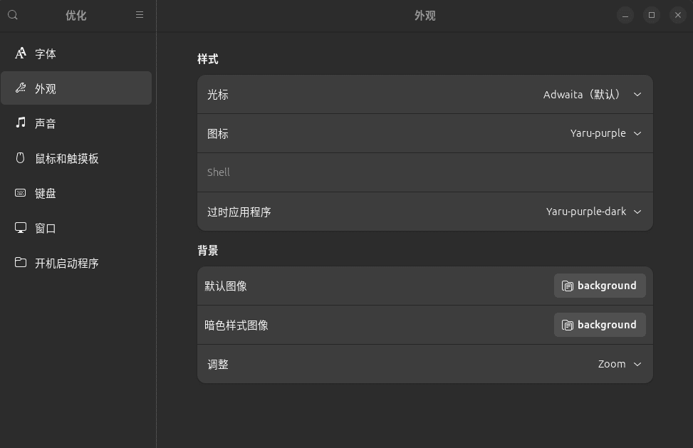

# <center>鼠标指针 </center>

## 使用apt命令安装

* 可以先用 apt 命令中的子命令 search 查找一下可用的鼠标指针主题

  ```
  apt search cursor-theme
  ```

  
* 选择一个自己喜欢的主题进行安装（这里用 bibata-cursor-theme 主题为例）

  ```
  sudo apt install bibata-cursor-theme
  ```

  
* 安装好后，使用 GNOME Tweaks 工具更换主题（如果没有 GNOME Tweaks 工具，通过以下命令进行安装）

  ```
  sudo apt install gnome-tweaks

  ```
* 打开 GNOME Tweaks 工具，选择 "外观" ，然后在 "光标" 部分选择您刚刚安装的主题。

  
* 这样就可以应用自己喜欢的鼠标指针主题了

## 手动安装鼠标指针主题

* 如果想从网上下载其他鼠标主题，可以按照以下步骤手动按照
* 解压下载的主题（这里用 WinSur-white-cursors 主题为例）

  ```
  tar -xzf WinSur-white-cursors.tar.gz
  ```
  
* 将解压后的文件夹复制到鼠标指针主题目录（鼠标指针目录：/usr/share/icons/）

  ```
  sudo cp -r WinSur-white-cursors /usr/share/icons/
  ```
* 最后，使用 GNOME Tweaks 工具选择并应用新鼠标指针主题。
