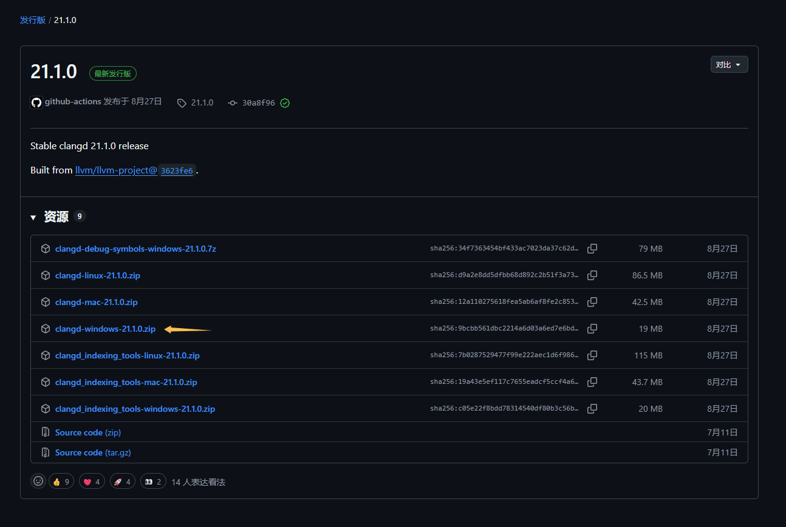
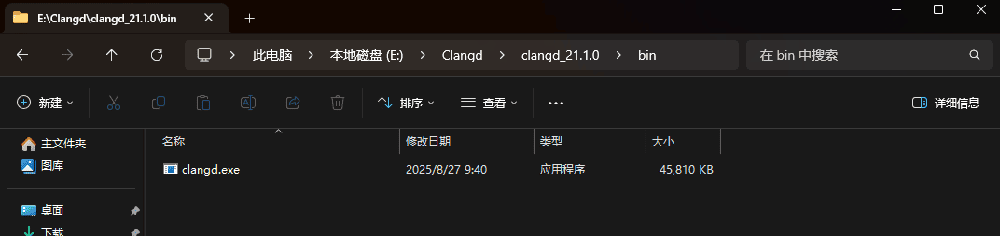
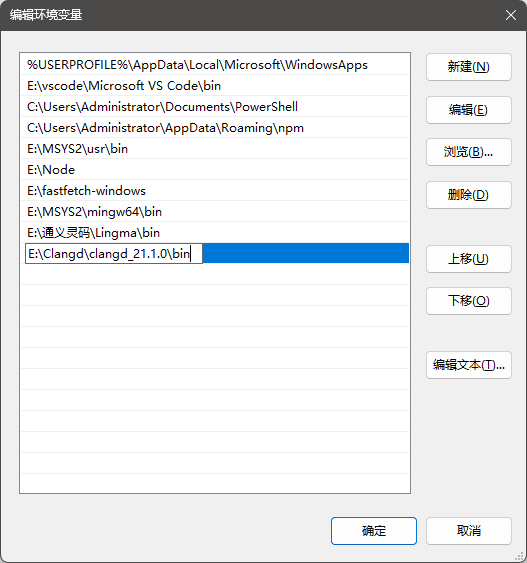
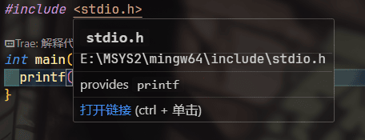
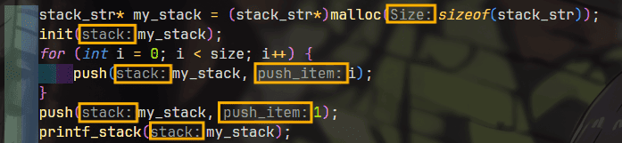

# <center>🚀 clangd 配置 </center>

## 🔗 clangd 和 clang

| 项目 | clang | clangd |
|----|----|----|
| 类型 | 编译器 | 语言服务器 |
| 是否编译代码 |<center> ✔️ </center>| <center>❌</center> |
| 是否生成程序 | <center> ✔️ </center> | <center>❌</center>  |
| 是否依赖编辑器 | <center>❌</center>  | <center> ✔️ </center> |
| 主要用途 | 构建程序 | 代码分析与提示 |

### 👋 一句话结论

- 👉 clang **真正负责编译与生成程序**
- 👉 clangd **负责代码分析与智能提示**

## 📥 下载 clangd

访问 clangd 的官方 Github 仓库：

👉 https://github.com/clangd/clangd

在 Releases 页面中，选择**适合你系统的压缩包**并下载：



💡 **提示**
Windows 用户通常选择：`clangd-windows-xxx.zip`

---

## 🧩 加入环境变量（PATH）

1. 解压你下载好的压缩包
2. 进入解压后的目录，找到 `bin` 文件夹
3. 在 `bin` 中可以看到 `clangd.exe`



将 **`clangd.exe` 所在目录** 添加到 **系统 PATH 环境变量** 中：



配置完成后，可以在终端中执行：

```bash
clangd --version
```

如果能看到版本号，说明配置成功 🎉

---

## 🧠 VS Code 配置 clangd

1️⃣ 安装 clangd 插件

打开 VS Code → 扩展（Extensions），搜索并安装：

**clangd（LLVM 官方）**


⚠️ 如果你之前安装过以下插件：

**C/C++（Microsoft）**

请将其 **禁用**，否则会和 **clangd 抢语言服务**，导致以下问题：

* 代码补全异常
* 跳转定义失败
* 提示重复或混乱

---

## 🛠️ 使用 clangd（项目配置）

📁 创建 .clangd 文件

在你的 **项目根目录** 下，新建一个文件：

```bash
.clangd
```

**注意**：文件名前面有一个点

✍️ 写入以下内容

```bash
CompileFlags:
  Add: 
    - "-IC:/msys64/mingw64/include"
    - "--target=x86_64-w64-windows-gnu"
```

🖥️ 你的文件结构应该是这样的

```bash
MyProject/
├── .clangd          ← 就放在这里（最外层）
├── main.c
├── test.c
├── include/
│   └── test.h
└── src/
    └── foo.c
```

📌 配置说明

🔹 -IC:/msys64/mingw64/include

告诉 clangd：**标准头文件位于该目录中**

适用于以下环境：

* MSYS2
* MinGW64
* gcc / g++

如果不配置，可能会出现 **头文件找不到** 的问题。

🔹 --target=x86_64-w64-windows-gnu

告诉 clangd：当前代码运行在 **MinGW（GNU ABI）的 64 位 Windows** 平台

✅ 验证是否生效

当鼠标悬停在头文件上，如果出现头文件路径或类型提示：



说明 clangd 已经可以正确解析头文件 🎉

---

## ✨ clangd 参数名提示（Inlay Hints）

如果你在写代码时，没有看到类似下面的参数名提示：



🔧 解决方法

打开 VS Code 的 `settings.json`，添加或确认以下配置：

```bash
"editor.inlayHints.enabled": "on"

```

该配置用于：

允许 **VS Code** 显示 **clangd** 提供的内联提示（例如参数名、类型提示等）
