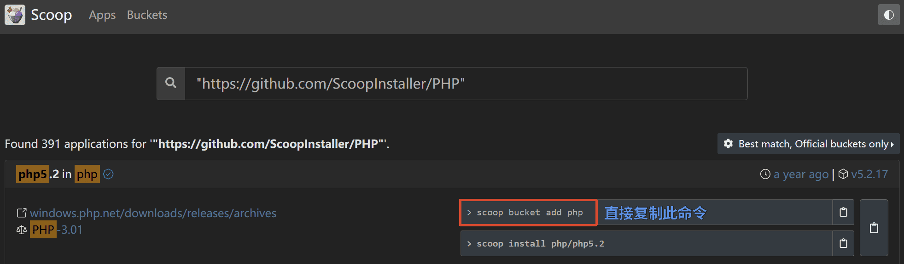
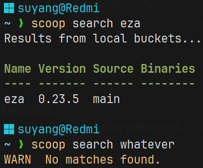
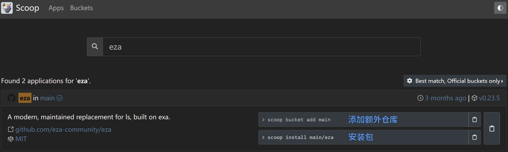
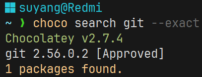

# <center>包管理器</center>

## `npm`

### 简介

`npm`是`Node.js`的默认包管理器。

- `Node.js`官网：[https://nodejs.org/zh-cn](https://nodejs.org/zh-cn)
- `npm`官网：[https://www.npmjs.com](https://www.npmjs.com/)

### 安装包

- 安装到项目
  ```sh
  npm install 包名  #正常写法
  npm i 包名  #简化写法
  ```
- 全局安装
  ```sh
  npm install --global 包名  #正常写法
  npm i -g 包名  #简化写法
  ```

### 更新

- 更新**自身**

  ```sh
  npm install -g npm@latest  #"@latest"表示最新的版本
  ```

- 更新**包**
  ```sh
  npm update [-g/--global] 包名  #在"package.json"指定的范围内升级
  npm install [-g/--global] 包名  #直接升级到最新版本
  ```

### 删除包

```sh
npm uninstall [-g/--global] 包名  #正常写法
npm remove [-g/--global] 包名  #简化写法
npm rm [-g/--global] 包名  #简化写法
npm r -g/--global 包名  #简化写法
```

## `Scoop`

### 简介

`Scoop`是一个基于**Windows**平台的命令行包管理器。

- 安装`Scoop`

```sh
Set-ExecutionPolicy -ExecutionPolicy RemoteSigned -Scope CurrentUser  #修改"PowerShell"的执行策略
Invoke-RestMethod -Uri https://get.scoop.sh | Invoke-Expression  #下载并执行"scoop"安装脚本
```

### 添加额外仓库

**注意**：`main`仓库默认已添加，无需重复添加。  
可在[Scoop仓库列表](https://scoop.sh/#/buckets)中搜索额外仓库，点击某个额外仓库，就能看到该仓库的所有包，每个包列出了两条命令，其中第一条就是添加额外仓库的命令：



```sh
scoop bucket add 仓库名  #添加额外仓库
```

### 搜索包

```sh
scoop search 包名
```



如图所示，如果包存在，则会列出包名、版本号、仓库名。如果包不存在，则会显示警告：`No matches found.`。

### 安装包

可在[Scoop应用列表](https://scoop.sh/#/apps)中直接搜索包名称，获得安装命令：



### 更新

- 更新**自身**

  ```sh
  scoop update
  ```

- 更新**所有包**

  ```sh
  scoop update *
  ```

- 更新**单个包**
  ```sh
  scoop update 包名
  ```

### 删除包

```shell
scoop uninstall 包名
```

## `Chocolatey`

### 简介

`Chocolatey`是一个基于**Windows**平台的现代化包管理器。  
**注意**：运行`Chocolatey`相关命令时，最好用**管理员**身份打开终端，否则可能会报错。

- 安装`Chocolatey`
  1. 用**管理员**身份打开终端
  2. 确保`PowerShell`执行策略不受限制：
  - 运行`Get-ExecutionPolicy`，如果返回`Restricted`则代表执行策略受到限制，此时可选择运行以下命令：
    ```sh
    #二选一运行即可
    Set-ExecutionPolicy AllSigned
    Set-ExecutionPolicy Bypass -Scope Process
    ```
  3. 执行以下命令：
     ```sh
     Set-ExecutionPolicy Bypass -Scope Process -Force; [System.Net.ServicePointManager]::SecurityProtocol = [System.Net.ServicePointManager]::SecurityProtocol   -bor 3072; iex ((New-Object System.Net.WebClient).DownloadString('https://community.chocolatey.org/install.ps1'))
     ```

### 搜索包

```sh
#搜索本地和远程仓库中所有与包名有关的包
choco [search/find] 包名
```

`choco [search/find] 包名`会搜索本地和远程仓库中所有与包名有关的包，比如搜索`git`，能搜出**349**个包，然而其中只有一个包是你需要的，找起来比较麻烦，可以加上`--exact`参数，只搜索精确匹配的包：

```sh
choco [search/find] 包名 --exact
```



### 安装包

```sh
choco install 包名
```

### 更新

- 更新**自身**

  ```sh
  choco upgrade chocolatey
  ```

- 更新**所有已安装的包**

  ```sh
  choco upgrade all
  ```

- 更新**单个包**
  ```sh
  choco upgrade 包名
  ```

### 删除包

```shell
choco uninstall 包名
```

## `cargo`

### 简介

`cargo`是`Rust`语言的构建系统和包管理器。因此，要使用`cargo`，必须安装整套`Rust`环境，即`Rustup`。

- `Windows`平台  
  访问[Rust官网](https://rust-lang.org/zh-CN/tools/install/)，下载`Rustup`安装包，安装即可。

- `Linux`平台  
  运行以下命令：
  ```sh
  curl --proto '=https' --tlsv1.2 -sSf https://sh.rustup.rs | sh
  ```

### 搜索包

```sh
cargo search 包名
```

### 安装包

```sh
cargo install 包名
```

### 更新

- 更新**自身**

  ```sh
  #二选一即可，二者效果是一样的
  rustup update
  rustup update --all
  ```

- 更新**所有包**

  ```sh
  cargo install cargo-update  #先安装"cargo-update"这个包
  cargo install-update -a  #更新所有全局安装的包
  ```

- 更新**单个包**
  ```sh
  cargo install cargo-update  #先安装"cargo-update"这个包
  cargo install-update 包名  #更新某个全局包
  ```

### 删除包

```shell
cargo uninstall 包名
```

## `pixi`

### 简介

`pixi`是一个快速、现代化、可再生的包管理器，适用于所有背景的开发者。

- 安装
  - `Windows`平台：  
    访问[pixi官网](https://pixi.prefix.dev/latest/#__tabbed_1_2)，下载安装包，安装即可。
  - `Linux`平台：  
    ```sh
    curl -fsSL https://pixi.sh/install.sh | sh
    ```

### 搜索包

```sh
pixi search 包名
```

### 安装包

```sh
pixi global install 包名  #全局安装
```

### 更新
- 更新**自身**
  ```sh
  pixi self-update
  ```

### 删除包

```shell
pixi global uninstall 包名  #全局卸载
```