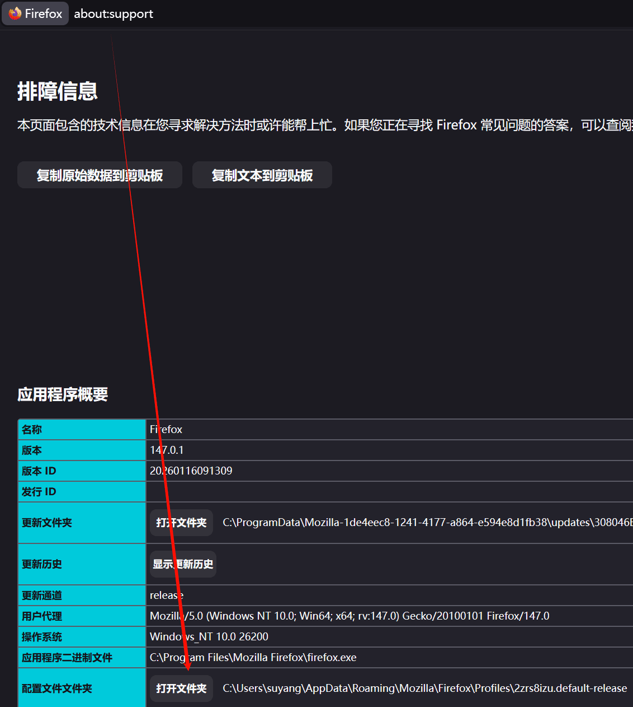
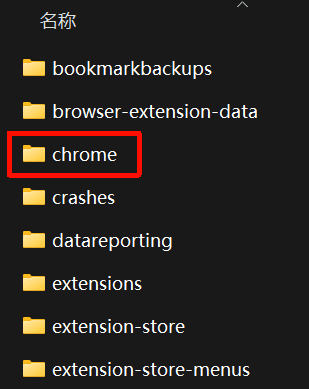
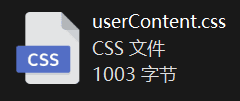
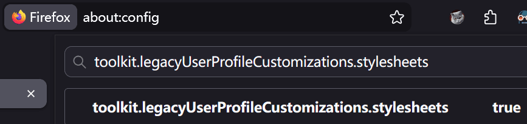
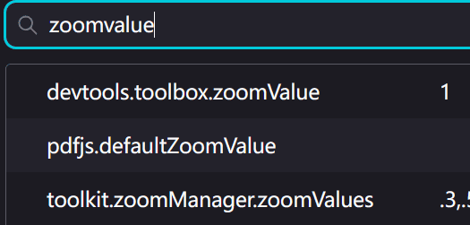
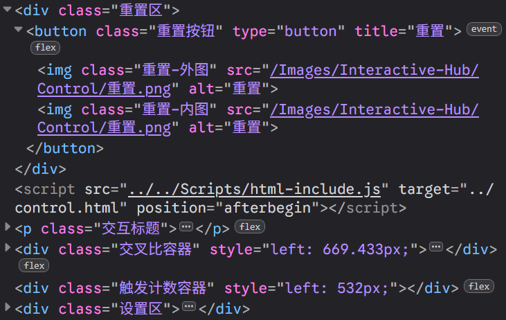

# <center>自定义 `FireFox` 开发者工具字体</center>

## 为什么要自定义？

`FireFox`浏览器的开发者工具会调用默认字体，在`Linux`或者`MacOS`上字体还不错，但是在`Windows`上，中文会默认调用`宋体`，在屏幕上非常难看：


并且`FireFox`没有提供设置选项来修改开发者工具字体，只能通过修改`userContent.css`文件来实现。

## 创建自定义样式表

- 打开`FireFox`的`配置文件路径`：
  - 在`FireFox`地址栏中输入 `about:support`，点击**打开配置文件夹**按钮，即可打开`FireFox`的配置文件路径。

  

- 访问`配置文件路径`中的`chrome`文件夹，如果没有，就创建一个。

  

- 在`chrome`文件夹中修改`userContent.css`内容，如果没有，就自己创建。

  

  将以下内容添加到`userContent.css`文件中：

  ```css
  /* 自定义 FireFox 开发者工具字体 */
  /* --------------------------------------------------------------------
  /* DevTools
  */
  @-moz-document url-prefix("chrome://devtools/content/")
  {
    :root {
      --theme-code-font-size: 14px !important; /* Inspector */
      /* --theme-body-font-size: 24px !important; /* Some of UI */
    }

    /* 开发者工具字体、控制台代码字体 */
    .devtools-monospace,
    .CodeMirror-line {
      font-family:
        "Google Sans Code",
        "JetBrains Nerd Font",
        Consolas,
        "Noto Sans SC",
        "HarmonyOS Sans SC",
        微软雅黑,
        monospace,
        -moz-fixed !important;
      font-size: 14px !important;
      font-weight: 400 !important;
    }

    /* DOM探查器字体 */
    .inspector-panel #markup-view {
      font-family:
        "Google Sans Code",
        "JetBrains Nerd Font",
        Consolas,
        "Noto Sans SC",
        "HarmonyOS Sans SC",
        微软雅黑,
        monospace,
        -moz-fixed !important;
      font-size: 14px !important;
      font-weight: 400 !important;
    }
  }
  ```

  当然，其中的`font-family`、`font-size`、`font-weight`都可以根据个人喜好进行修改。

## 开启`传统的用户配置自定义`

- `传统的用户配置自定义`自从`FireFox`**69**版本`(`**2019年9月**`)`开始就<a href="https://www.firefox.com/en-US/firefox/69.0/releasenotes/#changed" target="_blank">默认禁用</a>了，需要手动开启。

- 在`FireFox`地址栏中输入 `about:config`，点击**接受风险并继续**按钮，即可打开隐藏的首选项页面。

- 在搜索栏输入 `toolkit.legacyUserProfileCustomizations.stylesheets`，将值改为 `true`。



修改完成后，重启 `FireFox` 浏览器。

## 修改`开发者工具缩放值`

- 在`开发者工具`界面，用`Ctrl`+`空格`的方式，只能临时修改缩放值，关闭开发者工具后，缩放值会恢复之前的值，如果需要永久修改缩放值，需要做如下设置：
  - 在`FireFox`地址栏中输入 `about:config`，点击**接受风险并继续**按钮。
  - 在搜索栏输入"devtools.toolbox.zoomValue`，修改其值即可。

  

## 查看修改效果

再次打开开发者工具，即可看到修改效果：


